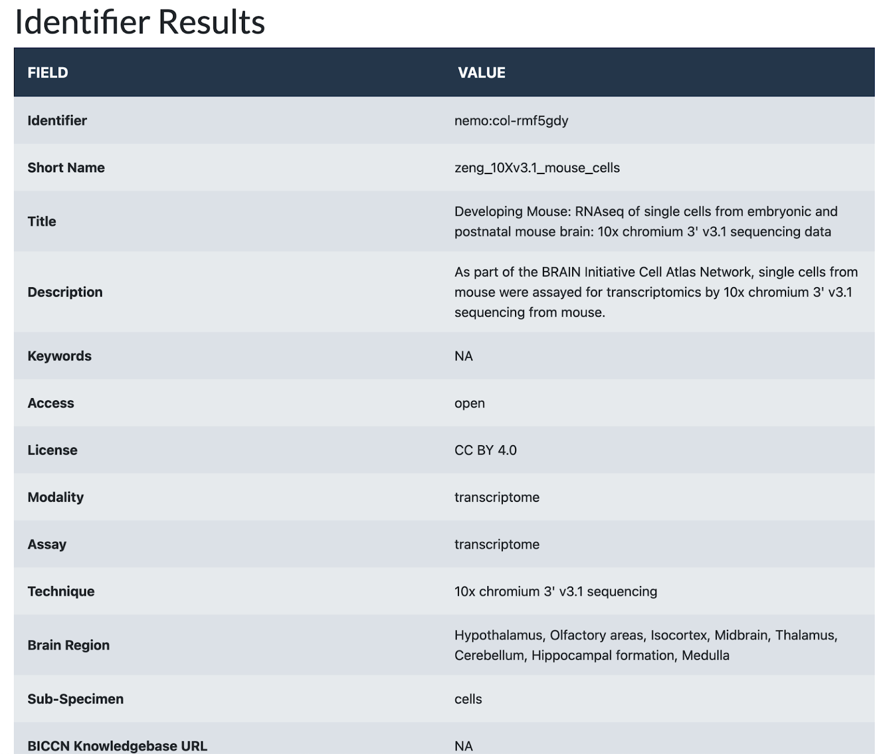
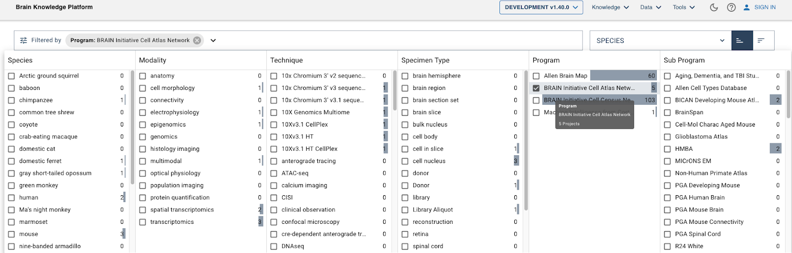
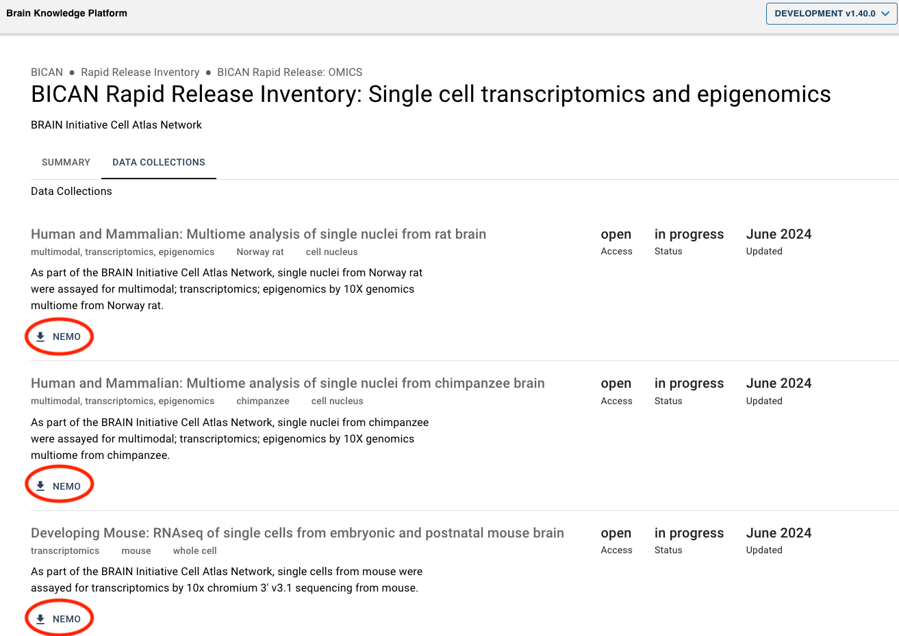
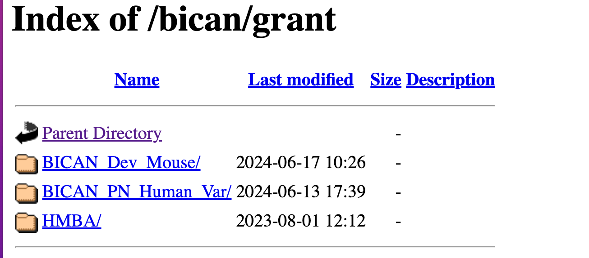
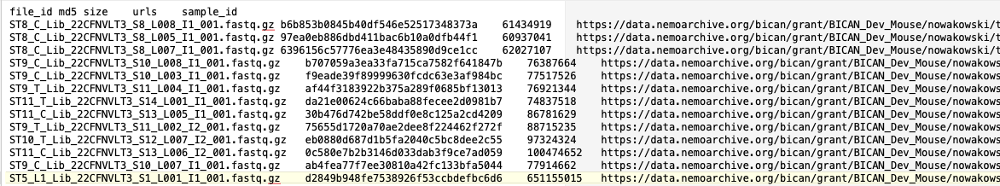

# **<h2 style = "text-align: center;">BICAN Rapid Release Data Access from NeMO</h2>**

The [BICAN](https://www.portal.brain-bican.org/) data that is submitted to NeMO comprises single-cell and single-nucleus transcriptomic and epigenomic data generated from samples derived from different species. A part of this data is made available to users through a Rapid Release (Quarterly Release). The data can be accessed in the following ways:

1) <a href = "#data-collections">Data collections and landing pages</a>	
    1) <a href = "#accessing-data">Accessing Data</a>	
        1) <a href = "#open">Open data</a>
        2) <a href = "#restricted">Restricted data</a>
    2) <a href = "#available-rapid-release">Data Collections Available in Rapid Releases</a>
    3) <a href = "#allen">Accessing NeMO Collections from Allen’s Brain Knowledge Platform (BKP)</a>
        1) <a href="#landing-pages">NeMO Collection landing pages linked in Project pages of BKP’s Data Catalog</a>
        2) <a href="#searching-filtering">Searching and filtering metadata and downloading a file manifest along with associated  specimen and donor metadata from Specimen table in BKP’s Data Catalog</a>
2) <a href = "#public-access-browser">HTTPS public access browser</a>
3) <a href = "#portal-tool">Portal-Client tool for downloading files using file manifest</a>

## <h2 id = "data-collections" style = "display: inline">1. Data collections and landing pages </h2>
 

**Data accessible: Restricted and open data**

A collection is a defined dataset that is generated by bundling data submitted under a specific grant,  lab, technique, species, subspecimen type, file format and data use limitation (for controlled access data). Each collection is assigned a unique NeMO identifier with a prefix “nemo:col:”. A meta-collection is a “collection of collections” which is generated by bundling a variety of data (collections). Example: A multiome fastq files meta-collection is generated by bundling ATAC and RNA collections together. The fastq files included in an ATAC collection (first child collection with a unique NeMO identifier) and RNA collection (second child collection with a unique NeMO identifier) are produced by sequencing libraries using two different techniques - 10X Genomics Multiome ATAC and RNA sequencing. Each meta-collection is also assigned a unique NeMO identifier. 

The (meta-)collection landing page provides basic metadata about the (meta-)collection and contains a link to a BDBag (an archive file containing downloadable file paths) for downloading the files. These pages are made available at [assets.nemoarchive.org](https://assets.nemoarchive.org/). To bring up a landing page for a particular (meta-)collection on a web browser, the NeMO (meta-)collection identifier (‘col’ identifier) has to be appended to the end of the url (Eg: [https://assets.nemoarchive.org/col-rmf5gdy](https://assets.nemoarchive.org/col-rmf5gdy)). A landing page can be identified as a meta-collection landing page if the “Technique”, “Access”, or “Species” section has more than one value.

The landing page contains a HTTPS link in the “HTTPS URL” section, when clicked, opens a HTTPS location where open access files associated with the (meta-)collection are released to the public for download. Restricted access files (Eg: restricted human data) and embargoed files are not accessible at HTTPS location. The page also contains a link to a downloadable BDBag in the “BDBag URL” section. Users will have to install the BDBag software to download the files from the bag. Please refer to this [documentation](https://docs.google.com/document/d/19saVuxG3H3j7i535eXoQEn6ypEUtIdvMnVjdbSMiKkU/edit) on installing the BDBag tool and downloading files from a BDBag. More information is available [here](https://github.com/nemoarchive/documentation/blob/master/download_bdbag.md). A meta-collection landing page has a master BDBag (“bag of bags”) linked in the“BDBag URL” section, which means that there will be a BDBag for each child collection within the master BDBag. Each child BDBag contains a manifest file containing a list of files available for download from the bag and the associated metadata. One important metadata element in the manifest is the “library_aliquot_nhash_id” which is a unique identifier for a library aliquot generated by the [NIMP](https://specimenportal.com/landing/index). It can be used for acquiring donor and specimen metadata from the [NIMP](https://specimenportal.com/landing/index) and [Brain Knowledge Platform’s (BKP) Data Catalog](https://knowledge.brain-map.org/data/BUQ7G50XHDCFCJCQ03A/specimens) Specimen table. Example of a collection landing page:  [https://assets.nemoarchive.org/col-rmf5gdy](https://assets.nemoarchive.org/col-rmf5gdy)

### <h3 id = "accessing-data" style = "display: inline">**Accessing Data**<h3>

1. **Open data**
    * The HTTPS link provided in the “HTTPS URL” section of the collection landing pages takes the user to a HTTPS server-based browser where open access data is available for download. Data can be downloaded from the location using any tools that support https downloads.
    * The data in the collection can also be downloaded from the BDBag linked in the “BDBag URL” section of the landing page. Users will have to install the BDBag software to download the files from the bag. Please refer to this [documentation](https://docs.google.com/document/d/19saVuxG3H3j7i535eXoQEn6ypEUtIdvMnVjdbSMiKkU/edit) on installing the BDBag tool and downloading files from a BDBag. More information is available [here](https://github.com/nemoarchive/documentation/blob/master/download_bdbag.md).

2. **Restricted data**

    * If a collection contains restricted access files, then the files within the BDBag linked in the landing page can be downloaded only if the user has [approval](https://nemoarchive.org/resources/accessing-controlled-access-data#nda-approval-process) from NIMH Data Archive (NDA) to access data. 

    * If a meta-collection contains a combination of restricted (raw and alignment) and open access (counts, peaks) collections, then the meta-collection landing page will have a HTTPS link in “HTTPS URL” section from where users can download open access data. This open access data will also be available for download from the child BDBags within the master BDBag. Restricted data will not be available in HTTPS location, but will be available for download from a child BDBag within the master bag only if the user has approval from NDA to access data. To obtain approval from NIMH, the user will have to log into NDA and open a request for access to the data at NeMO. After the request gets approved by the Data Access Committee (DAC), the user will receive an email notification of the decision. The user will have to forward the email to NeMO ([nemo@som.umaryland.edu](mailto:nemo@som.umaryland.edu)) to get access.

## <h3 style="display:inline-block" id="available-rapid-release" >**Data Collections Available in Rapid Releases**</h3>
 
All data collections made available in Rapid Releases are publicly accessible. There are no controlled access human datasets. Please click the links below to get more information on the collections included in Rapid Releases.

* [Data collections in June Rapid Release](https://docs.google.com/spreadsheets/d/1ez44SNq9wxf_gHkUyMDiVA5FtB4MwMrW425BZdaP99I/view)
* [Data collections in September Rapid Release](https://docs.google.com/spreadsheets/d/1yphvRLp8858E9LVqu5JCVN4U7brb4N5Z7i1Jr_o3TLE/view)

## <h2 style = "display:inline-block" id = "allen">**Accessing NeMO Collections from Allen’s Brain Knowledge Platform (BKP)**</h2>
 
There are two ways of finding NeMO collection data at Brain Knowledge Platform Data Catalog:

* NeMO Collection landing pages linked in Project page of BKP’s Data Catalog
* Searching and filtering metadata and downloading a file manifest along with associated specimen and donor metadata from Specimen table in BKP’s Data Catalog
  

* **<h3 style = "display:inline-block" id="landing-pages">NeMO Collection landing pages linked in Project pages of BKP’s Data Catalog</h3>**

The NeMO collection landing page URLs are linked under each collection listed in “DATA COLLECTIONS” section in the master BICAN program page - “[BICAN Rapid Release Inventory: Single cell transcriptomics and epigenomics](https://knowledge.brain-map.org/data/BUQ7G50XHDCFCJCQ03A/summary)” in BKP Data Catalog. 

1. Select BICAN Program in Data Catalog search filters:

2. Click on the “DATA COLLECTIONS” option in the Program page, then click on the “NEMO” link to navigate to the corresponding collection landing page where you will find links to collection BDBag and HTTPS path for file download. Details on downloading the files from a BDBag are in the section “[Data collections and landing pages](#data-collections) “ of this document. Details on accessing files from HTTPS links are in the section “[HTTPS public access browser](#public-access-browser)” of this document”. Allen’s documentation on finding collections is [here](https://community.brain-map.org/t/bican-rapid-release-reference-documentation/3693).

 

* **<h3 style = "display:inline-block" id = "searching-filtering">Searching and filtering metadata and downloading a file manifest along with associated specimen and donor metadata from Specimen table of BKP’s Data Catalog</h3>**

    A tutorial on searching the metadata and downloading a file manifest from [Specimen Table](https://knowledge.brain-map.org/data/BUQ7G50XHDCFCJCQ03A/specimens) of BKP’s Data Catalog is posted for users reference here- “[Download a file manifest for all female chimpanzees from Ed Lein’s - UM1MH130981 BICAN grant](https://community.brain-map.org/t/tutorial-download-a-file-manifest-for-all-female-chimpanzees-from-ed-lein-s-um1mh130981-bican-grant/3692)". The file manifest downloaded from Specimen table containing the HTTPS file paths can be used as an input into the Portal-Client tool to download the files after reformatting the manifest. Instructions can be found [here in the Allen Brain Map Community Forum](https://community.brain-map.org/t/how-to-use-bkp-file-manifest-to-access-bican-data-at-nemo-archive/3505#manifest-download-and-formatting-1). . Details on downloading the files in a manifest using portal-client are in the “[Portal-Client tool for downloading files using file manifest](#portal-tool)” section of this document.

## <h2 style = "display:inline-block" id = "public-access-browser">2. HTTPS public access browser</h2>
 

**Data accessible: Open data only**

The open access BICAN data is released at [https://data.nemoarchive.org/](https://data.nemoarchive.org/). Grant specific data can be accessed by navigating through the data directory structure. The top or root level of the HTTP browser is based on the program. Within each program, data is organized by grant, lab, modality, subspecimen type, technique, species, and data type. Individual files can be downloaded from the browser by right clicking on the file and copying/saving the link. For downloading via command line, use any online tools that support http downloads such as Wget or cURL.

Eg: [https://data.nemoarchive.org/bican/grant/](https://data.nemoarchive.org/bican/grant/)

## <h2 style = "display:inline-block" id = "portal-tool">3. Portal-Client tool for downloading files using file manifest</h2>
 

**Data accessible: Restricted and open data**

The Portal-Client is a python-based client for downloading data files hosted by an instance of the portal software developed by the GDC and further modified by the Institute for Genome Sciences (IGS). The user has to install the tool to download the files using portal-client compatible NeMO manifest file as an input. The manifest can be generated and downloaded from the Brain Knowledge Platform’s (BKP) Data Catalog hosted by the Allen Institute for Brain Science. Instructions on how to access and reformat it can be found [here in the Allen Brain Map Community Forum](https://community.brain-map.org/t/how-to-use-bkp-file-manifest-to-access-bican-data-at-nemo-archive/3505#manifest-download-and-formatting-1).  This manifest file contains the URLs for the files to be downloaded. These URLs can either be the HTTPS file paths and/or restricted GCP bucket file paths. The user will have to be granted access by NeMO to the restricted GCP bucket containing the controlled access files before downloading them using GCP bucket file paths in the manifest (refer to this [document](https://nemoarchive.org/resources/accessing-controlled-access-data#nda-approval-process) for getting approval from NDA to access controlled data at NeMO).  Refer to this [documentation](https://github.com/nemoarchive/documentation/blob/master/download_portal_client.md) for installing and using the Portal-Client tool.

**Portal-Client Compatible Manifest Template**

The manifest file is a 5 column tab delimited file. The columns in the same order as in the manifest:

file_id     (filename)

md5        (md5 checksum of the file)

size          (file size in bytes)

urls	  (downloadable file path, either HTTPS path or restricted GCP bucket path)

sample_id    (library aliquot name)

If the file size is not known, fill the hyphen (“-”) as a value in the column.

**Example of a manifest file:**

**Basic Invocation**

The following command is the most basic way of invoking the client by using the manifest file downloaded from the Data Catalog query interface.

portal_client --manifest /path/to/data_catalog_manifest.tsv

**Please email [nemo@som.umaryland.edu](mailto:nemo@som.umaryland.edu) if you have any issues/suggestions/comments.**
