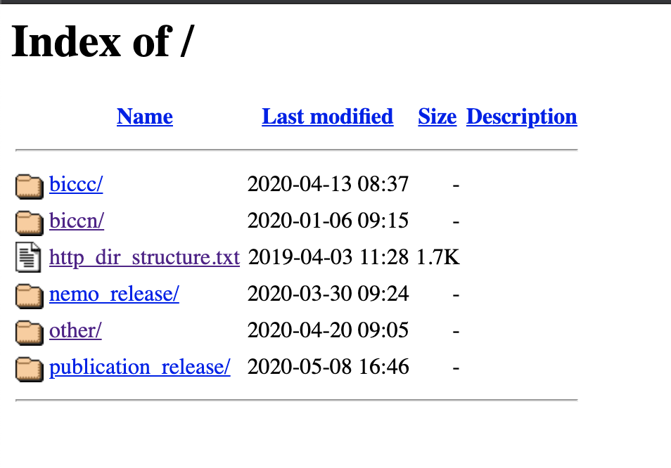

# HTTP Data Browsing

An HTTP server-based browser is available at [data.nemoarchive.org/](http://data.nemoarchive.org/) for navigation through the NeMO Archive public data directory structure described here. Data can be downloaded from the NeMO HTTP browser using any tools that support http downloads.
This document refers to public access data only. For controlled access data, see [Controlled Access Data](download_restricted.md).

&nbsp;


The top, or root, level of the HTTP browser separates data based on release or project:
#### Releases
 * `nemo_release/` contains a [bdbag](link) corresponding to quarterly NeMO releases. NeMO releases are synchronized to the same release schedule as the BCDC release schedule. These bags contain BICCN data only.
 * `publication_release/` contains one or more [bdbags](link) corresponding to dataset(s) analyzed for BICCN-associated publications. See [Data citation](./data_citation.md) for more information.

#### Projects
 * `biccc/` contains data generated within the BRAIN Initiative Cell Census Consortium, precursor to the BICCN
 * `biccn/` contains data generated as part of the ongoing [BRAIN Initiative Cell Census Network](https://biccn.org/)
 * `other/` In addition to hosting BRAIN Initiative data, the NeMO repository also hosts 'omics data from other neuroscience projects. Contact us if you would like to discuss submission of your dataset(s) to the NeMO Archives.


Within each project, data is organized by grant, lab, organism or modality. A snapshot of the `biccn` project area is shown here:

```
biccn
├── assay
│   ├── chromatin
│   ├── methylation
│   └── transcriptome
├── grant
│   ├── cemba
│   ├── devhu
│   ├── feng
│   ├── huang
│   ├── lein
│   ├── zeng
│   └── zhang
├── lab
│   ├── anderson
│   ├── arlotta
│   ├── callaway
│   ├── ecker
│   ├── feng
│   ├── kriegstein
│   ├── lein
│   ├── linnarsson
│   ├── macosko
│   ├── regev
│   ├── tolias
│   └── zeng
└── organism
    ├── human
    ├── marmoset
    └── mouse
```

Symlinks are used to organize data across these 4 top level directories, therefore the same data is accessible from each entry point, simply organized in different ways. For example, the lab directory data is organized next by modality, while the organism directory is organized next by grant. For the complete data structure, see Data Model (coming soon).  
