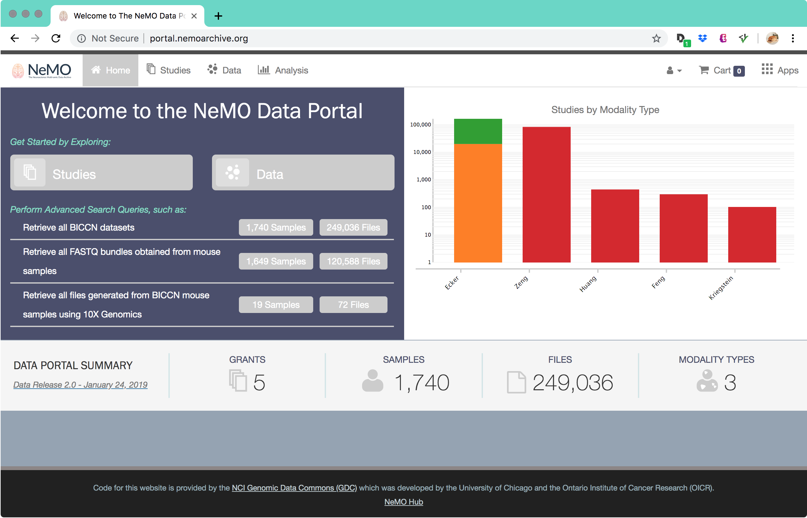
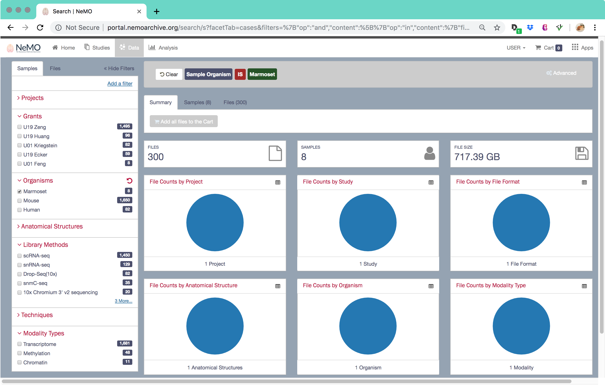
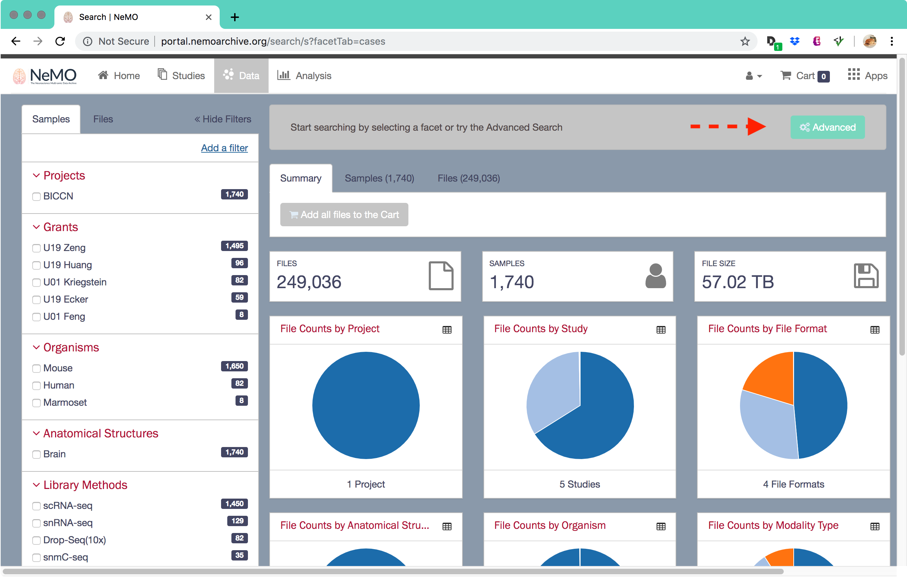

<a name="top"></a>

# Browsing Data in the NeMO Portal

This page describes how to use the [NeMO Data Portal](http://portal.nemoarchive.org/) for searching and downloading data that were generated during the course of this project.

This will include the following steps:

1. Navigate to Data section of [NeMO Data Portal](#go-to-the-nemo-portal)
2. Use [faceted or advanced search](#faceted-search) to identify the datasets of interest
3. Add the files of interest to the [shopping cart](#add-to-shopping-cart)
4. Download the [manifest file(s)](Download-Metadata-with-the-Portal)
5. Use the [IGS portal client](Download-with-Client) to download the files using the data manifest file


## Step 1. Go to the NeMO Portal <a name="go-to-the-nemo-portal"></a>

Please go to [NeMO Portal](http://portal.nemoarchive.org/), the data portal that provides a summary of the data as well as faceted and advanced search tools to identify data of interest. Here is what the site should look like.



The main landing page shows the summary of the data as a bar graph (number of samples) generated for each of the studies within the project. A user can click on the "Data" tab at the top-left or the "Data" button to switch to the faceted data search page of the portal. A user can also click on the "Studies" tab at the top-left or the "Studies" button to switch to view the summary of data generated by each of the studies.

The user may also click on one of the pre-defined queries on the left hand side to either look at the number of samples or files that match the criteria. For instance, one of the queries is to select all the samples or file bundles where the file type is FASTQ and the organism sampled is mouse. Clicking on the two buttons will filter the data for just this one study.

## Step 2. Faceted Search <a name="faceted-search"></a>

The NeMO Data Portal provides a simple faceted search query to help identify data of interest. The data page has a faceted search box on the left where the user may select one or more of the facets to filter down the samples of interest (See #1 in figure). On the top is the search box that dynamically shows the query being generated when the users selects or deselects a particular facet (See #2 in figure). On the right is a summary section that shows the summary of the currently selected data organized using different attributes (See #3 in figure).


All the pre-configured facets are shown in the facets panel. Facets can be attributes associated with samples, attributes such as projects, studies, organisms, or attributes specific to files, such as file types or formats. These are organized as two tabs in the Facet Panel, the **Samples** tab and the **Files** tab. The facets are organized into categories, for instance here the sample facet categories are *Projects* and *Studies*. The numbers next to the facet entries point to the number of samples that are associated with this particular attribute. For instance in the figure above, 48 samples were of the "methylation" modality type. As you click on the facets the page dynamically updates the number of samples, files, and data volume that match the selected criteria.

To select all the samples that originated from *marmosets*, select the appropriate facet.  This will update the display to show all samples and files that derive from marmosets, including fastq, BAM, TSV counts, and MEX counts bundles, if available. See figure below.



Once you have selected the study, you can use other facets if applicable to further narrow down the data. In this case there are no additional criteria to narrow down the files.

Once you have narrowed down the data, click on the **Files** tab to show a list of files that match the search criterion or you can click on the **Add all files to the Cart** button to add all the files to the cart.


[top](#top)

### Advanced Searches <a name="advanced-search"></a>

The "Advanced Search" feature is meant to be similar to how one would query a database directly. To start an advanced search, click the "Advanced" button from the Data Summary page (see figure below.)



Each query requires the following general format:

```bash
(property) (comparison operator) (value)
```

The property is what you want to search on. The comparison operator is how you want to relate your value to your property. Your value is what you want to subset your property by.

For example:

**project.name = "BICCN"** (see figure below)


After clicking "Submit Query", the results of this query will be only those samples and files that are associated with the project name "BICCN".  The summary pie charts will also be updated based on this search.

Try type this query in the interface and observe how auto-complete helps along the way. Auto-complete should be used for every query as it pulls directly from the database and makes sure you are searching by a valid property, comparison operator, and value. Thus, if you use auto-complete and find no results in your query, you know you have entered combinations of property+comparison operator+value which do not exist. It is also helpful to navigate through the values found as this consists of all the values that currently exist in the database for that particular property.

## Step 3. Add To Shopping Cart <a name="add-to-shopping-cart"></a>

Once you have narrowed down your search to identify the samples and files, you may click on the **Files** to see a listing of the files that match the search criteria. The files list table shows some basic information about the file including the access type, URL, the data category, file format, and size.


The user may click on the link to see more information about a particular file (see Figure below), or you may add that particular file to the cart by clicking on the cart icon next to the file list, or choose all the files, and add them to the shopping cart.


The shopping cart icon on the top right of the page will display the number of items currently in the cart. The user can continue to browse for additional files to add to the cart or proceed to download the selected files.

Once the desired data has been added, the data can then be viewed and downloaded.  Please check out the following page on [how to download the file and sample metadata](Download-Metadata-with-the-Portal)

[top](#top)
