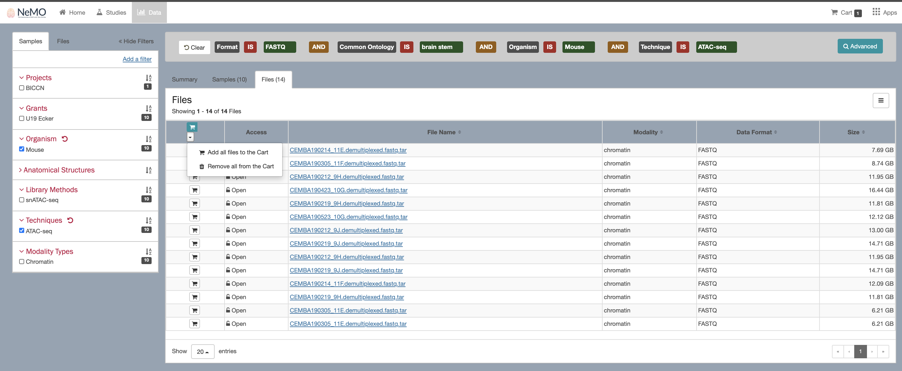

<a name="top"></a>

# The NeMO Portal
The NeMO Data Portal ([portal.nemoarchive.org](https://portal.nemoarchive.org/)) provides faceted search and advanced query tools to
enable users to explore data in a more customized way.

The portal landing page is broken up into 3 section:
 * The welcome box provides your entry to querying data, described in more detail below.
 * A bar graph breaks down number of samples per modality per study. This currently tracks open access, BICCN-funded data only.
 * The data portal summary bar at the bottom provides a high level summary of all data currently available through the NeMO portal.


&nbsp;

### Welcome Box

Begin exploring data by study or through the faceted or advanced search options. The `studies` button takes users to a summary page listing available studies, with links to all samples or all files associated with the study.

The `data` button takes users to the faceted data search page, the heart of the portal's functionality.

Below these are a set of pre-defined queries. As an example, one can easily retrieve all 10x Chromium 3' v2 sequenced FASTQ files, useful if you're interested in finding data suitable to [export to the Terra Optimus pipeline](export_to_terra.md).

&nbsp;

### Faceted Search Page

The NeMO Data Portal provides a simple faceted search query interface to help identify data of interest.
The faceted search page, accessible through the `Data` button of the landing page welcome box, is divided into 3 sections: the filter panel, the advanced search box and the summary results panel.

The filter panel on the left allows users to select one or more of the available facets to narrow down the samples of interest (See #1 in figure). Selecting any facet automatically populates the advanced search box with the current query (See #2 in figure). The summary results panel provides dynamic pie charts summarizing data corresponding to the currently selected filters (See #3 in figure).


The filter panel contains two tabs of pre-configured facets associated with
* samples (project, grant, organisms, anatomical structure, library method, technique and modality), or
* files (format, modality, data type)

The number next to each facet corresponds to the number of samples associated with this attribute across *all* projects in the portal. This number does not change dynamically as facets are selected or deselected. What does change is the summary results panel. As facets are selected, the file count, sample count and file size total will update to reflect the current filter(s). The pie charts will also update to reflect the current filter(s). Hovering over any of the pie charts will show a table of counts of files and total file size for each component of the pie chart. This table is also accessible by clicking on the table icon in the upper right corner of the pie chart to toggle between chart or table views.

In addition to filtering via the filter panel, users can click directly on a pie piece or table field to dig further into a specific component of the dataset. Once data has been refined to the dataset of interest, click on the **Files** tab of the summary results panel. From here, files can be added to the shopping cart, as described below.

Additional facets are available by ***Add a Filter*** in the upper right of the filter panel. The resulting pop-up lists all additional searchable facets available, which can be browsed or searched for using the search bar at the top. Clicking on any facet will add it to the top of the filter panel for incorporation into the current filter.

##### Example query
Dr. White is interested in mouse ATAC-seq data. Specifically, he wants to see what brain regions have been sequenced and have raw data available at the NeMO archives. Starting at [portal.nemoarchive.org/](https://portal.nemoarchive.org/), he takes the following steps:
1. Click the `Data` button in the welcome box to access the faceted search page.
2. In the Samples filter panel, select Mouse in the Organism category, and ATAC-seq in the Techniques category. This narrows his results to mouse ATAC-seq data.
3. In the Files filter panel, select FASTQ in the Format category. This further narrows the search to only raw FASTQ files. This filter could also have been applied from the pie chart summary panel.
4. In the summary results panel, navigate to the File Counts by Anatomical Structure pie chart, and click on the table icon in the upper right corner of the chart box, as shown in the screenshot below. This allows Dr. White to see a breakdown of the brain regions from which cells have been sequenced.


5. After some consideration, and *lots* of teleconferences with collaborators, Dr. White decides that he wants to analyze the brain stem samples in conjunction with some of his own personal data. In order to access those specific raw FASTQ files, he clicks on brain stem in the summary results panel table from step 4.

6. He clicks on the Files tab and adds all files to his shopping cart using the cart icon at the top of the Files box.



&nbsp;


### Advanced Search

The Advanced Search feature simulates querying a database directly. To begin an advanced search, click the "Advanced" button in the upper right corner of the advanced search box.


A query requires the following basic format:

```bash
(property) (comparison operator) (value)
```

The property is the facet that you're searching on. Beginning to type a facet will bring up a lost of allowable The comparison operator is how you want to relate your value to your property.  The value is what you're filtering the property on.  
Accepted comparison operators are: = (equals), != (not equals), NOT, IS, IN and EXCLUDE.

For example:
**project.name = "BICCN"**


Clicking "Submit Query" will update the summary results panel in the same way as the faceted search.

Auto-complete helps in entering an advanced query. Auto-complete will pull all valid options directly from the database to ensure that a user's search contains a valid property, comparison operator, and value. If auto-complete suggests no results in your query, you know that you have entered nonexistent combinations of property+comparison operator+value. The auto-complete feature is also helpful in that it allows users to browse all current values in the database for that particular property.

### Adding Files To Shopping Cart <a name="add-to-shopping-cart"></a>
Once data has been refined to the dataset of interest, click on the **Files** tab of the summary results panel. This will bring up the list of files matching the search criterion. The files list table provides some basic information about the file including access type, URL, data category, file format, and size.


Clicking on an individual file takes users to a summary page for the selected file, with the option to download via the `Download` button in the upper right.


To download multiple files, users can either click on the shopping cart icon to the left of all files of interest or select the shopping cart dropdown at the top left of theFiles table and select **Add all files to the Cart**.

The cart icon on the top right of the page will display the number of items currently in the cart. At this point, users can continue to browse for additional files, combine results of multiple queries, or proceed to the cart page to download the selected files. [Downloading files and metadata are described here](to be added).

[top](#top)
