<a name="top"></a>

# The NeMO Portal

The NeMO Data Portal ([portal.nemoarchive.org](https://portal.nemoarchive.org/)) provides faceted search and advanced query tools that enable users to explore data in a more flexible and customized way. 

The portal landing page is broken up into 3 sections:

 * The **Welcome box** provides your entry to querying data, described in more detail below.
 * A **Bar graph** breaks down number of files per modality per study. This currently tracks open access, BICCN-funded data only.
 * The **Data Portal Summary bar** at the bottom provides a high level summary of all data currently available through the NeMO portal.<br><br>

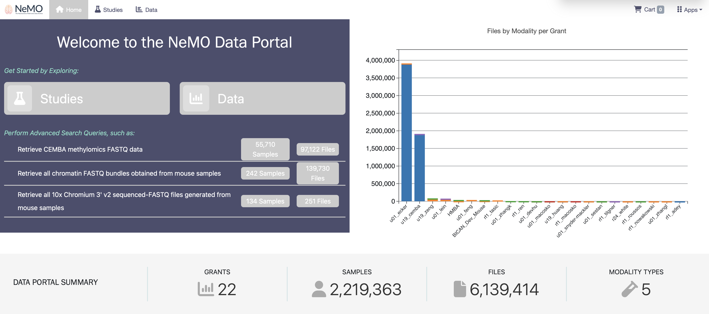

*<p align="center">Fig. 1 : The NEMO portal landing page showing the Welcome box (left) , Bar graph breakdown of files per modality and study (right) and the Data Portal Summary bar (bottom)</p>*<br>

### Welcome Box

Users can begin exploring data by study or through the faceted or advanced search options. The `Studies` button takes users to a summary page listing available studies, with links to all samples or all files associated with each study.

The `Data` button takes users to the faceted data search page, the heart of the portal's functionality.

Below these buttons is a set of pre-defined queries. For example, the third query can be used to easily retrieve all 10x Chromium 3' v2 sequenced FASTQ files generated from mouse samples. This is particularly useful if you are interested in finding data suitable to [export to the Terra Optimus pipeline](export_to_terra.md).<br>

## Studies Page

The **Studies** page lists all available studies/grants and labs along with counts of associated samples and files and the total file size (Fig. 2). Clicking on the files or samples associated with a particular study or lab allows users to work with that subset of data. Users can customize the displayed columns using the hamburger icon in the upper right corner.<br><br>

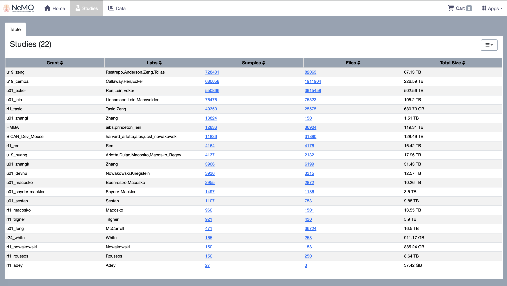

*<p align="center">Fig. 2 : Summary page of available studies with links to associated samples and files</p>*<br><br>


### Faceted Data Search Page

The NeMO Data Portal provides a simple faceted search query interface to help users identify the data of interest. The faceted search page (*Fig. 3*), accessible through the `Data` button in the landing page welcome box, is divided into 3 sections (*Fig.4*): 

* **Faceted Search box**
* **Advanced Search box**
* **Summary Results Panel** <br><br>

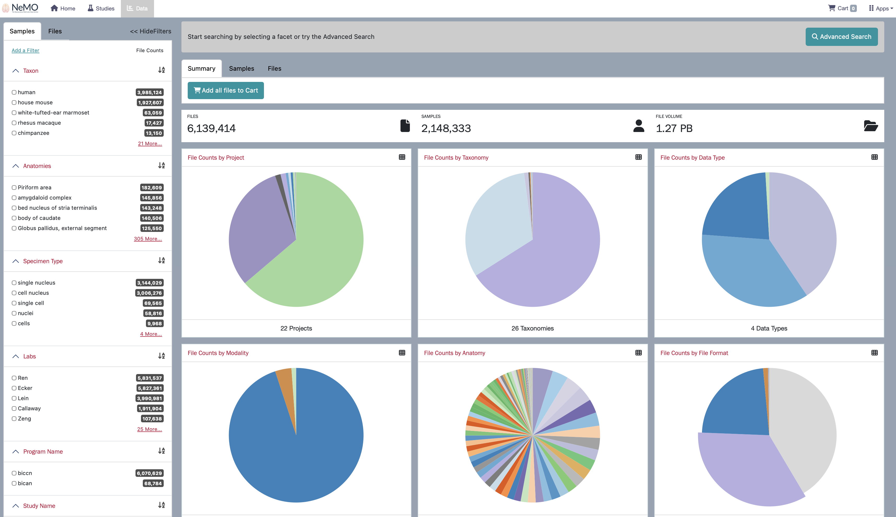

*<p align="center">Fig. 3: Faceted Data Search page accessible through the Data button of the landing page</p>*<br>

The *Faceted Search box* on the left is a filter panel that allows users to select one or more of the available facets to narrow down the samples of interest (*See #1 in Fig. 4*). Selecting any facet automatically populates the *Advanced Search box* with the current query (*See #2 in Fig. 4*). The *Summary Results Panel* provides dynamic pie charts summarizing data corresponding to the currently selected filters (*See #3 in Fig. 4*).<br><br>

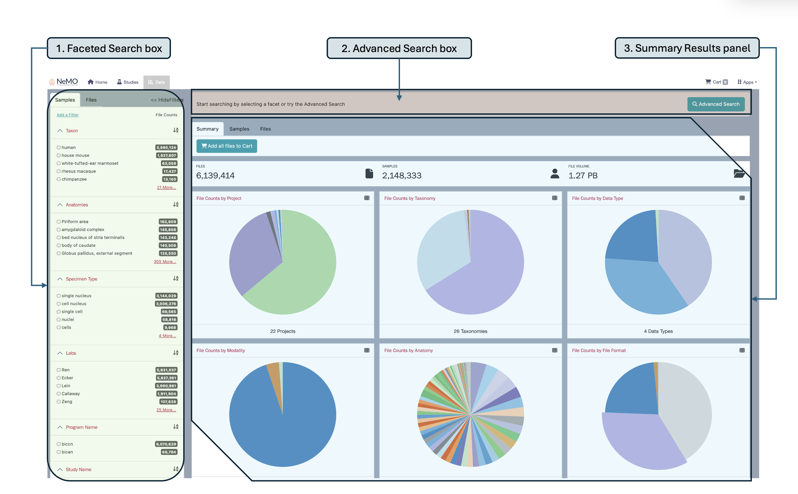

*<p align="center">Fig. 4 : Screenshot of the Faceted Data Search page showing the 1) Faceted Search box, 2) Advanced Search box and 3) Summary Results Panel</p>*<br><br>


### Faceted Search Box

The faceted search box contains two tabs of pre-configured facets associated with
* **Samples** (taxon, anatomies, specimen type, labs, program name, study name, modality and technique) or
* **Files** (access, data type, format) <br><br>


#### Adding Filters to the Faceted Search box:

Additional facets can be added to the Faceted Search box using *Add a Filter* in the upper left of the faceted search panel. The resulting pop-up lists all additional searchable facets available, which can be browsed or searched for using the search bar at the top. Clicking on any facet will add it to the top of the filter panel for incorporation into the current filter. <br><br>


*<p align="center">Fig. 5: Adding filters to the Faceted search box. A pop up appears where you can search for available file, sample, subject and study-specific facets</p>*<br>

Figure 5 illustrates how to add a filter and search for available facets using the search bar that pops up.  Note that **Assay** is not listed as a default facet under **Samples** tab in the faceted search panel. However, when you add **Assay** as a filter, it appears under **Samples** in the faceted search panel, as you can see in the figure below (*Fig. 6*). 

Users can search for and add additional filters that are file-, sample-, subject- or study-specific. All study-specific facets can be searched for by typing *study* in the *Add a filter* search box. Similarly,  file-, sample- and subject-specific facets can be searched and added. All study-, sample- and subject-level facets that are added will appear under the **Samples** tab in the faceted search panel, while file-specific facets will appear under the **Files** tab. 

To remove filters, you can either click **Remove Added Filters** to clear all added filters or remove individual filters by clicking the red **X** next to the corresponding filter. Added filters will persist between sessions until you remove them.

Next to each filter, the alphabet (**AZ**) icon allows you to sort the filter terms in ascending or descending order. This is especially helpful when working with long lists of search terms, such as those under **Anatomies**. <br><br>

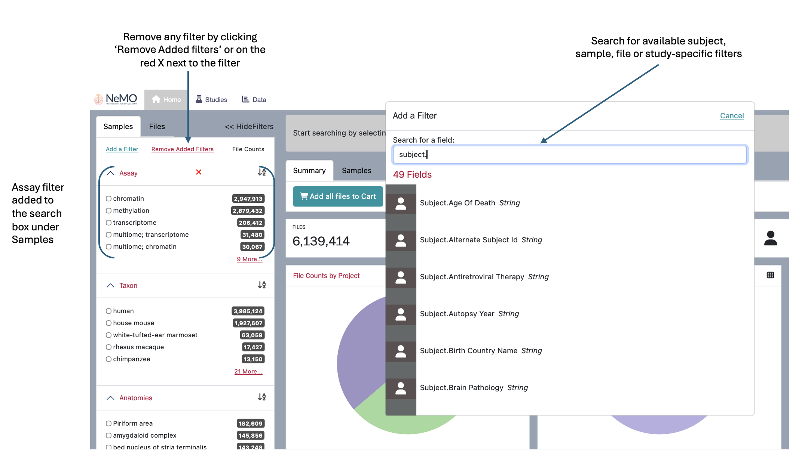

*<p align="center">Fig. 6: Screenshot illustrating how an added filter (Assay) appears in the Faceted search box, how to remove added filters and how to search for available search facets</p>*<br><br>

### Summary Results Panel

The results from the faceted search box and additional filters are organized into three views - **Summary**, **Samples** and **Files**. 

Under the **Summary** tab, results are displayed as pie charts showing file counts by project, taxonomy, data type, modality, anatomy and file format. 

The number displayed next to each facet in the faceted search box corresponds to the total number of samples associated with this attribute across all projects in the portal. This number does not change dynamically as facets are selected or deselected. What does change is the summary results panel. As facets are selected, the file count, sample count and total file volume will update to reflect the current filter(s). The pie charts also update accordingly. 

Hovering over a pie chart displays count information for each component. Each summary pie chart also includes a table icon in the upper right corner. Selecting this icon switches the view to a table showing counts of files and total file size for each component, allowing users to toggle between chart and table views.<br><br>


<p float="left">
  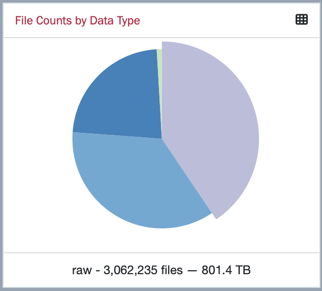
  
</p>

*<p align="center">Fig.7: Screenshot of the Pie chart (left) representing File Counts by Data Type, with the raw data type component selected. The table view (right) lists file counts and total file volume, by data type</p>*<br>

The **Samples** tab in the Summary results panel lists all the samples associated with the query. By default, the displayed columns include sample ID, sample name, anatomical site, species, modality and study name.  Users can customize the displayed columns using the hamburger icon in the upper right corner. 

Similarly, the **Files** tab lists files that match the search query, along with details such as access (open or restricted), file ID, file name, modality, data format and file size.<br><br>


##### Example query <br>

Dr. White is interested in mouse ATAC-seq data. Specifically, he wants to see which brain regions have been sequenced and have raw data available at the NeMO archive. Starting at [portal.nemoarchive.org/](https://portal.nemoarchive.org/), he takes the following steps: <br>

1. Click the `Data` button in the welcome box to access the Faceted Data Search page.

2. In the **Samples** tab of the Faceted Search Box, select 'house mouse' under **Taxon**  and 'atac-seq' under **Technique**
   
3. Switch to the Files tab of the Faceted Search Box and select 'fastq' as **Format**
     
4. In the Summary Results Panel, navigate to the 'File Counts by Anatomy' pie chart, and click on the table icon in the upper right corner of the chart box, as shown in the screenshot below (*Fig. 8*). This allows Dr. White to see a breakdown of the brain regions from which cells have been sequenced, which are also accessible under **Anatomies** in the **Samples** tab of the faceted search box. <br><br>

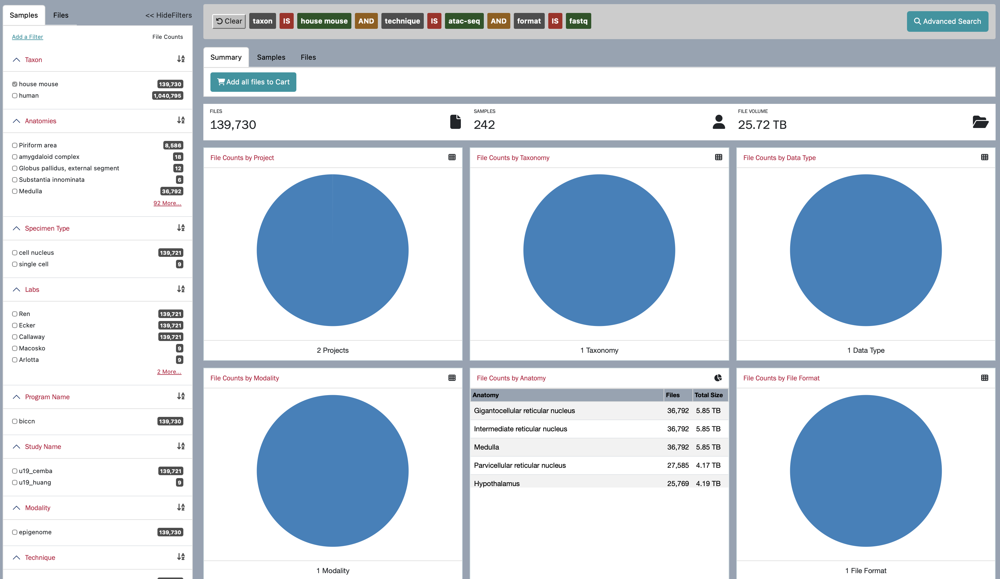

*<p align="center">Fig.8: Screenshot of the Summary results panel displaying the outcome of faceted data search for raw mouse ATAC-seq data</p>*<br><br>

5. After some consideration, and *lots* of teleconferences with collaborators, Dr. White decides to analyze the *thalamus* samples in conjunction with some of his own personal data. In order to access thalamus-specific raw FASTQ files, he clicks 'More...' option under the **Anatomies** filter in the **Samples** tab of the faceted search box and then selects 'Thalamus'. This narrows down the search results to thalamus-specific raw FASTQ files from mouse ATAC-seq data, as shown in *Fig.9*.

6. Next, he clicks the 'Add all files to Cart' button under the Summary tab in the Summary Results Panel to add all files to his shopping cart.<br><br>

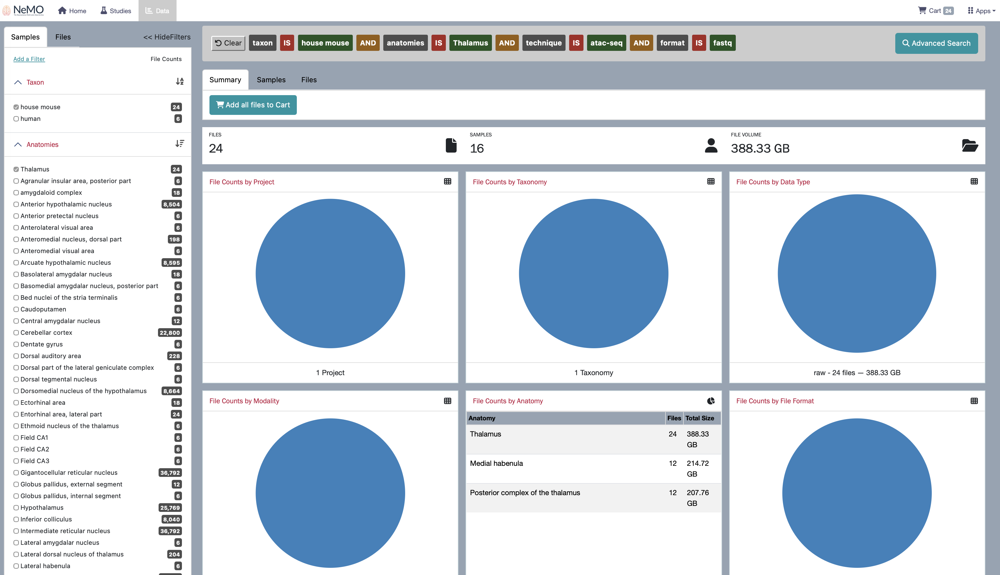

*<p align="center">Fig.9: Screenshot of the Summary Results Panel after narrowing the search to the thalamus region</p>*<br>

### Advanced Search Box

The Advanced Search feature simulates querying a database directly. To begin an advanced search, click the "Advanced Search" button in the upper right corner of the advanced search box. <br><br>

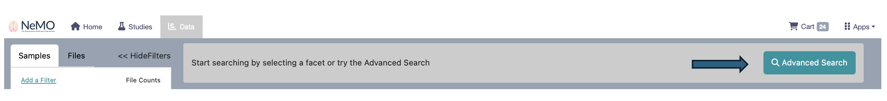

*<p align="center">Fig. 10: Screenshot of Advanced Search box in the Faceted Data Search page</p>*<br>

A query requires the following basic format:

```bash
(property) (comparison operator) (value)
```

The property is the facet that you're searching on. As you start typing a facet, a list of allowable options will appear. The comparison operator specifies how you want to relate your value to your property.  The value is what you are filtering the property by. 

Accepted comparison operators are: = (equals), != (not equals), NOT, IS, IN and EXCLUDE.

For example, if you want to search for human fastq files under BICCN program submitted by White lab , you will type the query as: 


*     study.program_name in ["biccn"] and study.labs in ["White"] and subject.taxon in ["human"] and file.format = "fastq"

The auto-complete feature helps in entering an advanced query. It pulls all valid options directly from the database to ensure that the user's search contains a valid property, comparison operator, and value. If auto-complete suggests no results in your query, you know that you have entered nonexistent combinations of property+comparison operator+value. The auto-complete feature is also helpful in that it allows users to browse all current values in the database for that particular property. In *Fig. 11* the options for *file format* pops up as part of this auto-complete feature.<br><br>


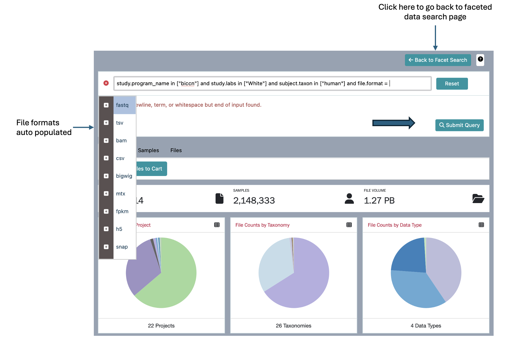

*<p align="center">Fig. 11: Screenshot of the advanced search query showing the auto-complete feature for available file formats</p>*<br>


Clicking "Submit Query" will update the summary results panel in the same way as the faceted search. You can return to the Facet Search page by clicking the "Back to Facet Search" button as shown in *Fig. 12*. Users can add all files from the search results to their shopping cart by clicking the "Add all Files to Cart" button.<br><br>

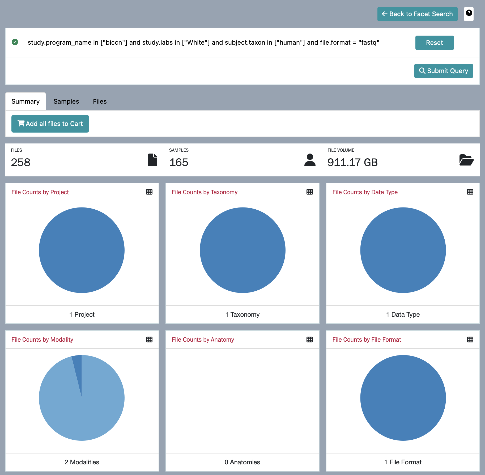

*<p align="center">Fig. 12: Screenshot of the Summary results panel displaying the outcome of advanced search query for human FASTQ files from the White Lab under BICCN program</p>*<br><br>


### Adding Files To the Shopping Cart <a name="add-to-shopping-cart"></a>
Once the data has been refined to the dataset of interest, click on the **Files** tab in the summary results panel, to view all files matching the search criteria. To download files, users can either click on the cart icon to the left of individual files of interest OR add all files from the query results to the cart by clicking on 'Add all files to Cart' button under the Summary tab. 

For example, If a user wants to download **open access** files from **human multimodal** samples generated using **10x Genomics Multiome**, they can follow these steps:

1. Click the `Data` button in the welcome box to access the Faceted Data Search page.

2. In the **Samples** tab of the Faceted Search Box, select
   * 'human' under **Taxon**
   * 'multimodal' under **Modality** 
   * '10x Genomics Multiome' under **Technique**
   
3. Switch to the Files tab of the Faceted Search Box and select:
   *  'open' as **File access**

User can then click the 'Add all files to Cart' button under the Summary tab to add all the open access files from human multimodal samples generated using 10x Genomics Multiome technique, or select only desired files to add to the cart. *Fig. 13* shows a screenshot where four files from the query results have been added to the cart, with their cart icons highlighted in green.<br><br>


*<p align="center">Fig. 13 : Screenshot showing the addition of selected files to the cart</p>*<br>

Clicking on an individual file takes users to a summary page for the selected file (*Fig. 14*). This summary page provides details such as the file name, access, data format, size, MD5 checksum, data category, data type and project. Users can add the selected file to the cart directly from this page by clicking on the cart icon. In *Fig. 14*, the green-colored cart icon indicates that the file is already in the cart. The **Cart** icon in the upper-right corner of the page displays the number of items currently in the cart. <br><br>


*<p align="center">Fig. 14: Screenshot of the individual file summary page. The selected file can be added to the cart directly from this page</p>*<br>

Users can continue to browse for additional files, combine results from multiple queries, or proceed to the cart page to download the selected files. Clicking on the **Cart** icon opens the cart page, which lists all selected files and provides additional details such as file ID, file name, access, data type, data format, modality, individual file size and total file volume of all files in the cart (*Fig. 15*).

Individual files can be removed from the cart by clicking on the trash icon to the left of each file, or all files can be removed at once by clicking the *Remove from Cart* button.

Users can download the **File Manifest** and **Sample Metadata** files or **Export to Terra** using the **Download** button. Downloading and analyzing large files can be very resource intensive and hence it is recommended to use the **Portal Client** for downloading files. In order to download files using the portal client, a **File Manifest** is required, which includes file ID, MD5 checksum, file size, file URL and the associated sample id. Instructions for using the portal client to download files with a file manifest, are available on the [Github](https://github.com/IGS/portal_client) page,  which can also be accessed via the **Data Transfer** link under the **Apps** button in the upper-right corner of the portal page (*Fig. 16*). <br><br>


*<p align="center">Fig. 15: Screenshot of the Cart page</p>*<br><br>


## Quick Access to Documentation and other important links

An **Apps** button is located at the upper-right corner, next to the Cart icon. Clicking the Apps button opens a dropdown menu that provides quick access to important webpages and resources including:

* **Data Portal** - takes users to the NeMO Data Portal home page
* **Website** - links to the official NeMO Website
* **API** - links to the GitHub documentation page, providing an overview of NeMO APIs
* **FAQ** - directs users to the webpage listing key personnels to contact for any questions/comments
* **Documentation** - links to a webpage which provides documentation on browsing data portal, downloading publicly available data from NeMO portal using the portal client, exporting data to Terra for analysis and information about data collection landing pages.
* **Data Transfer** - links to the IGS Portal Client GitHub page, which provides guidance on downloading files using the portal client.
* **Resources** - takes users to a webpage listing available resouces at NeMO  <br><br>

  


*<p align="center">Fig. 16 : Screenshot of the links accessible through the Apps button on the NeMO portal home page</p>*<br>


