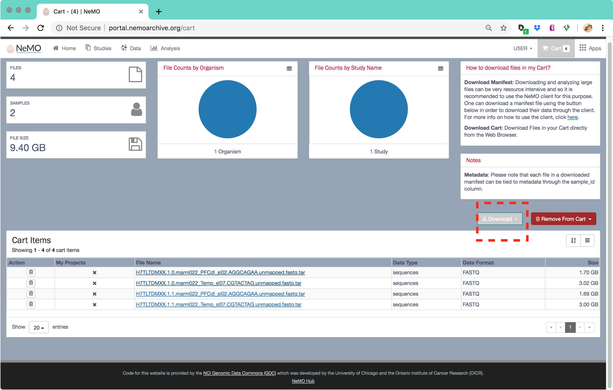
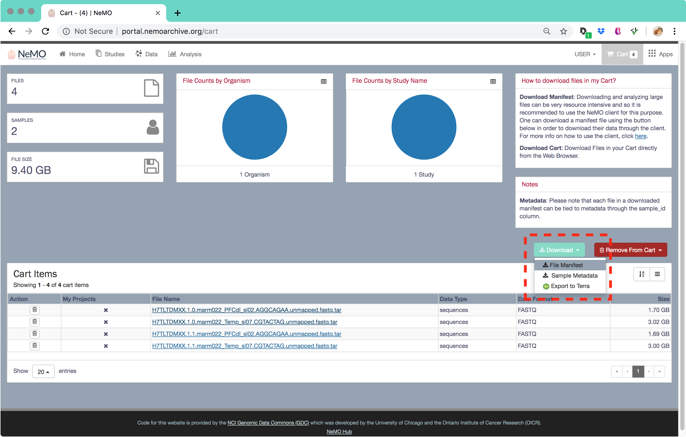

# Downloading File and Sample Metadata

To get started with this tutorial, it is recommended that Steps 1 - 3 are followed in the [**Search for Data in the NeMO Portal**](Search-for-Data-in-the-NeMO-Portal) page so that there are files in the Shopping Cart.

For this example we will start with the four files from the shopping cart as picture below.

The data portal has been designed to optimize bulk data downloads. Although the user can use the URLs to download individual files, we recommend that users use the bulk downloading capability. Bulk downloads are accomplished by creating a file manifest of the items in the cart. This file manifest can be used in conjunction with the [Portal Client](https://github.com/IGS/portal_client) or you may write a simple command line script to iterate over the manifest file to download the data.

Click on the shopping cart icon in the top-right of the screen to view the contents of the shopping cart. The details include a summary of the contents including the file count, and the data volume. In addition it gives a listing of the files with some details (See Figure below).

The user can download the manifest file(s) which includes the information needed by the [Portal Client](https://github.com/IGS/portal_client) to fetch the data from NeMO. There are two manifest files associated with the items in the cart, the file manifest and the file metadata manifest. The file manifest has the information needed to download the files including the unique ID of the file, the MD5 check sum if available, the file size, the URL(s), and the unique ID of the sample that this file is associated with. The metadata manifest has all the metadata information associated with the samples. In this case the file includes the study name, the sample name, the unique sample ID, the BioProject ID for this study, and the overall project name. This unique sample ID in the metadata manifest can be used to correlate the samples with specific files. Please note that one sample may be associated with one or more files.

Click on the **Download->File-Manifest** menu item (see highlighted box in Figure above) to download the manifest file to the local computer. You may also optionally download the sample metadata associated with the files in the manifest by downloading the **Sample Metadata** file.

***File Manifest Example***

NOTE: The file is a TSV file but it is been prettied up in a readable table format

file_id|md5|size|urls|sample_id
---|---|---|---|---
e7284e8e-1d8e-4140-824c-cac562f5c41c|2a4d123abdd72cf199c5ae4ee1ac46d7|1701160960|gs://nemo-public/biccn/grant/feng/transcriptome/scell/raw/CJACCHUS_001_marm022_PFCdl_sl02/H7TLTDMXX.1.0.marm022_PFCdl_sl02.AGGCAGAA.unmapped.fastq.tar,https://data.nemoarchive.org/biccn/grant/feng/transcriptome/scell/raw/CJACCHUS_001_marm022_PFCdl_sl02/H7TLTDMXX.1.0.marm022_PFCdl_sl02.AGGCAGAA.unmapped.fastq.tar|marm022_PFCdl_sl02
824d115e-c742-4263-9aa2-64a55b503e20|6e98b9eb90f1bfaac3c51813b7040739|3016355840|gs://nemo-public/biccn/grant/feng/transcriptome/scell/raw/CJACCHUS_001_marm022_Temp_sl07/H7TLTDMXX.1.0.marm022_Temp_sl07.CGTACTAG.unmapped.fastq.tar,https://data.nemoarchive.org/biccn/grant/feng/transcriptome/scell/raw/CJACCHUS_001_marm022_Temp_sl07/H7TLTDMXX.1.0.marm022_Temp_sl07.CGTACTAG.unmapped.fastq.tar|marm022_Temp_sl07
a4fe2dcb-4e54-4fff-9420-bbfdc1b1478e|a327494b60bf2cb043ed2032298f0f61|1687654400|gs://nemo-public/biccn/grant/feng/transcriptome/scell/raw/CJACCHUS_001_marm022_PFCdl_sl02/H7TLTDMXX.1.1.marm022_PFCdl_sl02.AGGCAGAA.unmapped.fastq.tar,https://data.nemoarchive.org/biccn/grant/feng/transcriptome/scell/raw/CJACCHUS_001_marm022_PFCdl_sl02/H7TLTDMXX.1.1.marm022_PFCdl_sl02.AGGCAGAA.unmapped.fastq.tar|marm022_PFCdl_sl02
f23d1138-89c7-45d8-b6df-f189f6461ef4|266c61e1796a1de276eded5a3e464e8c|2996592640|gs://nemo-public/biccn/grant/feng/transcriptome/scell/raw/CJACCHUS_001_marm022_Temp_sl07/H7TLTDMXX.1.1.marm022_Temp_sl07.CGTACTAG.unmapped.fastq.tar,https://data.nemoarchive.org/biccn/grant/feng/transcriptome/scell/raw/CJACCHUS_001_marm022_Temp_sl07/H7TLTDMXX.1.1.marm022_Temp_sl07.CGTACTAG.unmapped.fastq.tar|marm022_Temp_sl07

***Sample Metadata Manifest Example***

NOTE: The file is a TSV file but it is been prettied up in a readable table format

sample_id|project_id|sample_anatomical_region|sample_organism|sample_library_method|sample_modality|sample_technique|sample_transgenic_line|study_full_name|project_name|project_grant|project_lab|project_organization|subject_subtype
---|---|---|---|---|---|---|---|---|---|---|---|---|---
marm022_PFCdl_sl02|c1f151ed-31e5-4534-9de2-7e34bdb58d32|Brain|Marmoset|snRNA-seq|Transcriptome|Drop-seq|Unknown|feng_transcriptome_marmoset_10X|BICCN|Feng|Feng|Massachusetts Institute Of Technology|feng_feng
marm022_Temp_sl07|c1f151ed-31e5-4534-9de2-7e34bdb58d32|Brain|Marmoset|snRNA-seq|Transcriptome|Drop-seq|Unknown|feng_transcriptome_marmoset_10X|BICCN|Feng|Feng|Massachusetts Institute Of Technology|feng_feng
marm022_PFCdl_sl02|c1f151ed-31e5-4534-9de2-7e34bdb58d32|Brain|Marmoset|snRNA-seq|Transcriptome|Drop-seq|Unknown|feng_transcriptome_marmoset_10X|BICCN|Feng|Feng|Massachusetts Institute Of Technology|feng_feng
marm022_Temp_sl07|c1f151ed-31e5-4534-9de2-7e34bdb58d32|Brain|Marmoset|snRNA-seq|Transcriptome|Drop-seq|Unknown|feng_transcriptome_marmoset_10X|BICCN|Feng|Feng|Massachusetts Institute Of Technology|feng_feng

Once you have the manifest files on your computer use the **Portal Client** to download the files described in the manifest files to your computer.

[top](#top)
