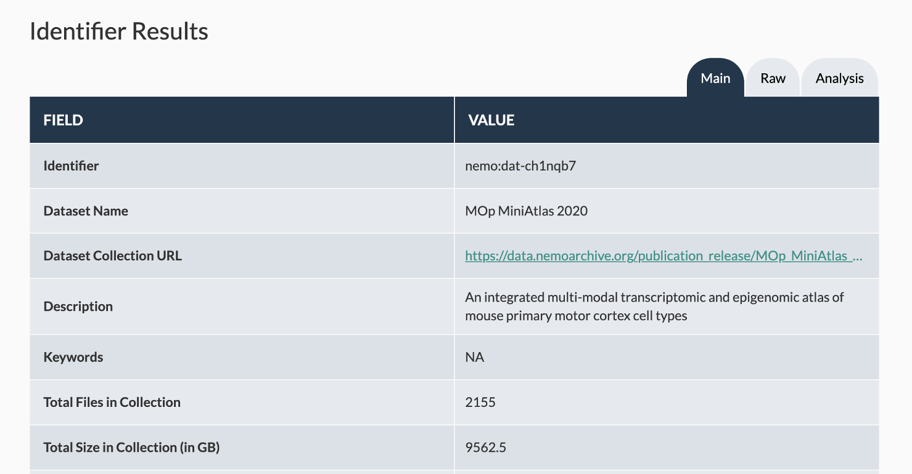
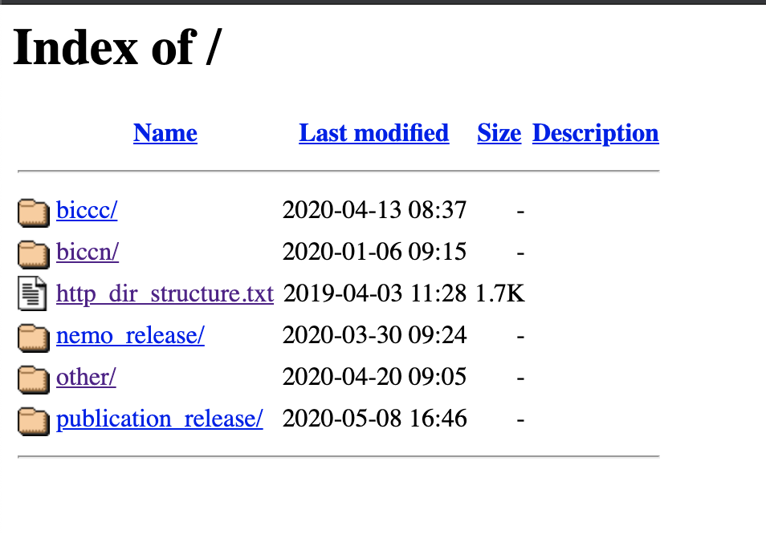

# Downloading Publicly Available Data

Data submitted to NeMO falls into three categories:
* *Public* - data to be immediately distributed openly and freely to the wider research community,
* *Embargo* - data to be held back, or embargoed, until a specific date, at which point it will be released openly and freely to the wider research community,
* *Restricted* - Controlled access data to be distributed only to an approved group of users due to consent restrictions, e.g. human data. Often restricted datasets contain a combination of private (raw reads, alignments) and public (counts, peaks) datatypes.  In such instances, the dataset landing page or BDBag will provide direct access to public data, in addition to a link to restricted data access instructions.

There are many ways that users may be introduced to data at NeMO Archives, depending on whether you're arriving at our site directly or from another resource. For Restricted
data access, see the [documentation here](download_restricted.md). For public data users, we've put together this handy table to recommend the most appropriate way to
access data:

| So you want to... | We recommend... |
| --- | --- |
| Access a specific dataset from a publication | Collection landing pages  |
| Access a specific data collection found in the BICCN Data Inventory | Collection landing pages |
| Browse to explore the types of data available across the project | HTTP Browser  |
| Download an entire NeMO release by date | HTTP Browser |
| Download all data associated with a particular grant | HTTP Browser or Data Portal |
| Download all data generated by a particular lab | HTTP Browser or Data Portal |
| Download all data associated with a particular technique | Data Portal |
| Download all data from a specific species (mouse, marmoset, macaque) | Data Portal |
| Download all counts data | Data Portal |
| Download all data from a particular anatomical site | Data Portal |
| Pull data into NeMO Analytics, Terra, Metaviz and other tools to run custom pipelines | Data Portal |


Each of these access points is introduced here, with links to further documentation if necessary.

&nbsp;

## Data collection landing pages



&nbsp;

Landing pages are available at [assets.nemoarchive.org](https://assets.nemoarchive.org/). We are integrating a search function to allow users to search by NeMO identifier, but in the meantime, you can
pull up any dataset of interest by adding the NeMO identifier to the end of the url, e.g. 
```
assets.nemoarchive.org/dat-ch1nqb7
```

Each data collection landing page corresponds to a defined dataset, either from a publication or a direct link from [biccn.org](biccn.org). Landing pages contain basic metadata
about the dataset, along with links to either the HTTP browser (see next section) if the dataset corresponds to a single branch of the directory structure,
or a [BDBag](https://bd2k.ini.usc.edu/tools/bdbag/) if it contains a subset of data or data across multiple modalities, labs or cell types.
More information about downloading and working with BDBags is [available here](./download_bdbag.md).

If you are a PI or a data submitter and would like to organize a data collection into a BDBag and/or request a landing page for a data collection or publication, see our [documentation on organizing data into a BDBag](Organize_data_into_BDBag.md).

&nbsp;

## HTTP directory structure browser
An HTTP server-based browser is available at [data.nemoarchive.org](http://data.nemoarchive.org/) for navigation through the NeMO Archive public data directory structure.
Data can be downloaded from the NeMO HTTP browser using any tools that support http downloads.



The top, or root, level of the HTTP browser separates data based on release or project:
##### Releases
 * `nemo_release/` contains a [BDBag](download_bdbag.md) corresponding to quarterly NeMO releases. NeMO releases are synchronized to the same release schedule as the BCDC release schedule. These bags contain BICCN data only.
 * `publication_release/` contains one or more [BDBags](download_bdbag.md) corresponding to dataset(s) analyzed for BICCN-associated publications. See [Data citation](./data_citation.md) for more information.

##### Projects
 * `biccc/` contains data generated within the BRAIN Initiative Cell Census Consortium, precursor to the BICCN
 * `biccn/` contains data generated as part of the ongoing [BRAIN Initiative Cell Census Network](https://biccn.org/)
 * `other/` In addition to hosting BRAIN Initiative data, the NeMO repository also hosts 'omics data from other neuroscience projects. Contact us if you would like to discuss submission of your dataset(s) to the NeMO Archives.

Within each project, data is organized by grant, lab, organism or modality. Read more about the [data storage model](data_model.md).

&nbsp;

## NeMO Data Portal
The NeMO Data Portal provides faceted search and advanced query tools to enable users to explore data in a more customized way.
To help users find data, the NeMO Data Portal uses a structured query approach. The interface offers a simple faceted search mode along with an advanced search mode.
The faceted search uses a predefined subset of curated popular metadata fields as facets, including grants, organism, anatomical structures, data modality, library methods, and file format.
Through a simple point-and-click interface, the user can generate a summary of the number of samples, file types and data sizes matching their selected criteria.
The summary is displayed graphically as a set of interactive pie charts that can be clicked on to further refine the search. Once a user has identified a set of files of interest, they can add this set to a data cart for further operations, including direct download or export to [Terra](https://terra.bio/).


&nbsp;

Additional NeMO Data Portal documentation can be found at the following pages:
* [Browsing the NeMO Data portal](browse_portal.md)
* [Downloading data using the portal client](download_portal_client.md)
* [Exporting data to Terra for analysis](export_to_terra.md)
