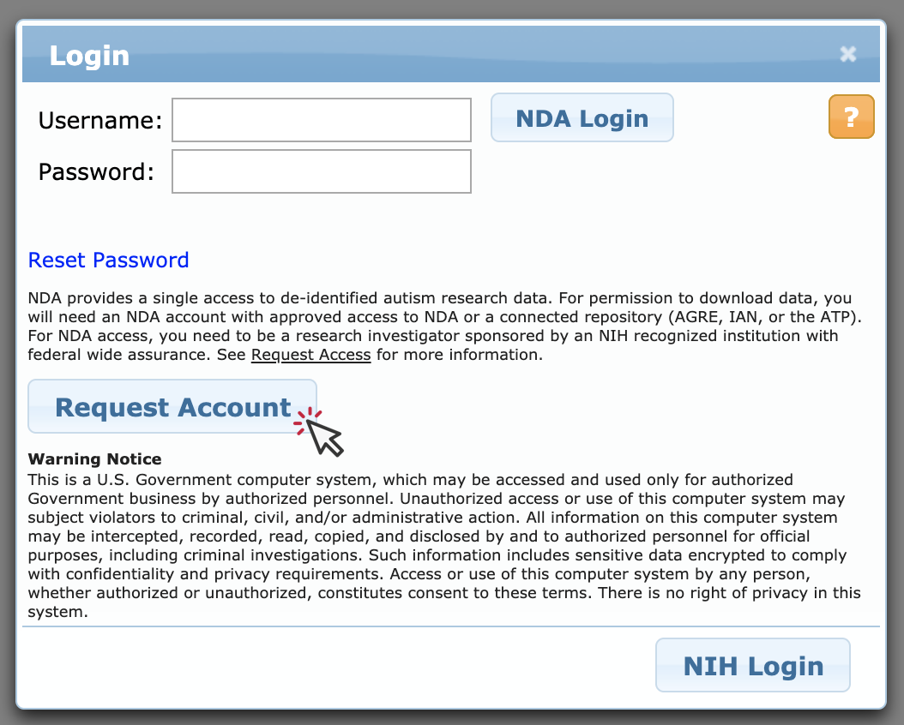
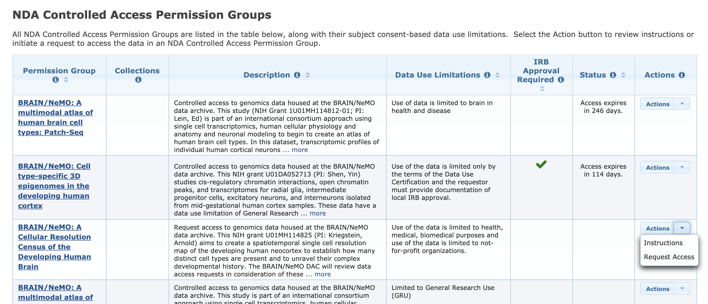
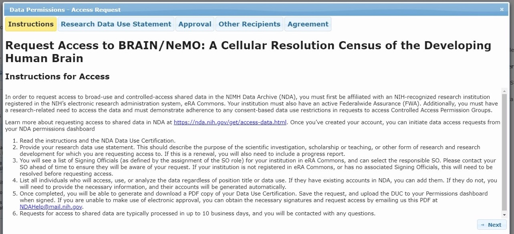
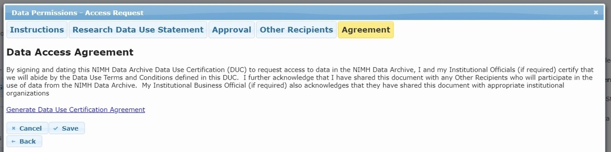
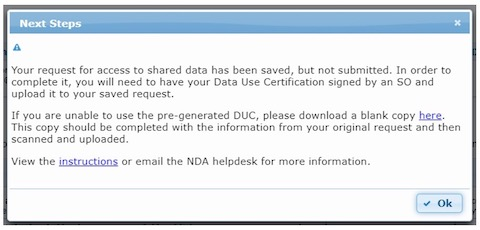
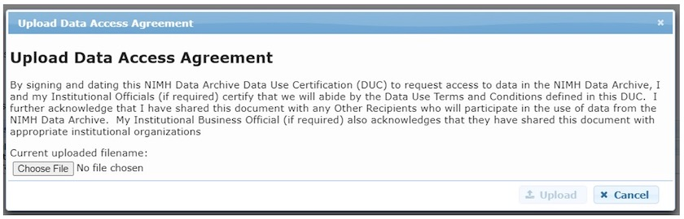

# Accessing Controlled Access Data

Data submitted to NeMO falls into three categories:
* *Public* - data to be immediately distributed openly and freely to the wider research community,
* *Embargo* - data to be held back, or embargoed, until a specific date, at which point it will be released openly and freely to the wider research community,
* *Restricted* - Controlled access data to be distributed only to an approved group of users due to consent restrictions, e.g. human data, through the processes described here. Often restricted datasets contain a combination of private (raw reads, alignments) and public (counts, peaks) datatypes.  In such instances, the dataset landing page or BDBag will provide direct access to public data, in addition to a link to this page for restricted data access instructions.

We are in the process of updating our website to include a list of restricted datasets available for access request. In the meantime, you can
see the list by logging into the [NIMH Data Archive](https://nda.nih.gov/) and selecting Get Data > Request Access. Under
**NDA Controlled Access permissions Groups**, you will find all BRAIN/NeMO restricted datasets currently available for access request.

### In this document:
1. [Requesting access through the NDA Approval Process](#nda-approval-process)
2. [Downloading Data](#downloading-data)

&nbsp;

### NDA Approval Process
Permissions for restricted data access at NeMO are being facilitated by the [NIMH Data Archive (NDA)](https://nda.nih.gov/). NDA and NeMO are working together to ensure a smooth process. NDA provides an SOP for institutionally sponsored data access requests [here](https://nda.nih.gov/about/standard-operating-procedures.html#sop4), however this page outlines the steps required for **NeMO-specific** restricted data access.

&nbsp;


&nbsp;

#### Step 1. Create an NDA account
[Create an NDA account here](https://nda.nih.gov/user/create_account.html).

**NDA account requests MUST be made using an institutional email address**.
Account requests made from a personal account will not be honored by NeMO or NDA and will therefore slow down
the process of accessing data.



#### Step 2. Identify Datasets available through the NDA Dashboard
Log in to the [NDA Permissions Dashboard](https://nda.nih.gov/user/dashboard/data_permissions.html).

Here you will find BRAIN/NeMO
Data Archives dataset(s) within the NDA Controlled Access Permission Group table of the dashboard. To the right is
an 'Actions' dropdown. Select "Request Access".
**You must work at a research institution** that has an active
[Federal-Wide Assurance](https://www.hhs.gov/ohrp/federalwide-assurances-fwas.html) in order to initiate a data access request.



#### Step 3. Data Access Request Tool
This will open the Data Access Request Tool where you will provide information pertaining to your research,
institution, and collaborators. Please carefully review the instructions for properly filling out all tabs of the request tool:

##### A) Request Access Instructions


##### B) Research Data Use Statement
Access requests for controlled access permission groups should include a Research Data Use Statement that
appropriately addresses consent-based data use limitations for that permission group.
To determine if there are consent-based data use limitations to which authorized researchers must adhere, refer to the
“Data Use Limitations” field next to the BRAIN/NeMO dataset of interest in the NDA Controlled Access Permission Group table.

##### C) Authorized Research Institute
You must work at a research institution that has an active [Federal-Wide Assurance](https://www.hhs.gov/ohrp/federalwide-assurances-fwas.html) in order to initiate a data access request.
The signing official(s) associated with your institution will automatically appear as a selectable option.

##### D) Other Access Recipients
Each data access application is restricted to users from a **single institution.**
If you have collaborators at other organizations, they must submit a separate data access application.

#### Step 4. Download Data Use Certificate (DUC)
Download the Data Use Certification Agreement PDF from the Agreement tab and complete with signatures of both the investigator and the institutional Signing Official. [Contact the NDA Help Desk](mailto:ndahelp@mail.nih.gov) if you need assistance identifying Signing Officials at your research institution.

  



#### Step 5. Upload signed DUC
Log into the NDA Permissions Dashboard and upload the signed DUC to the “Active Requests” section at the top of the NDA Permissions Dashboard.


&nbsp;



#### Step 6. Review
Your data access request will be reviewed by an NIH Data Access Committee (DAC). This process typically takes about one week.

#### Step 7. Access request decision
NDA will inform investigators of a final access decision.
At this time, you will need to **forward your Access Approval email to the NeMO team** at <a href=“mailto:nemo@som.umaryland.edu”>nemo@som.umaryland.edu</a>. Failure to do so will delay our sending you your access credentials.
NeMO will grant data access to investigator for *one year*, after which investigators will need to reapply for access using the process described above.

&nbsp;


### Downloading Data 
#### using Google Cloud Platform

*If you are a legacy data user and still have access via Aspera, those [download instructions can be found here](https://github.com/nemoarchive/documentation/blob/master/download_restricted_aspera.md).*
  
Restricted NeMO data is now available through Google Cloud Platform (GCP). There are two mechanisms for access, web interface and command line. NeMO data is **requester pays**, therefore downloading by either mechanism requires the use of a Google billing account.  In order to avoid incurring large charges for data download, we strongly recommend that you run data analyses on GCP if possible.  


&nbsp;


#### Step 1. Creating an institutional Google Cloud account
Once you have received your NDA approval, the next step is to set up an institutional google account. This can be done by going to [https://myaccount.google.com/](https://myaccount.google.com/) and selecting Create Account, using the SAME institutional email address that you used for NDA account creation. *Not sure what email address is associated with your NDA account? Log in to NDA to access your user dashboard. You will find your email address under your Profile.*  
  
For example, if you used the email address **janedoe@som.umaryland.edu** when you set up your NDA account, then you would now create a new google account using **janedoe@som.umaryland.edu**

Once set up, notify nemo@som.umaryland.edu as to your institutional google account creation. At this time, we will configure permissions and provide you with the  bucket name(s).  

#### Step 2. Setting up GCP Billing
NeMO restricted data accesses uses a requester pays model, therefore downloading data requires the setup of a billing account. In order to avoid incurring large charges for data download, we stongly recommend that you run data analyses on GCP if possible.  

To set up a new billing account go to [https://console.cloud.google.com/billing](https://console.cloud.google.com/billing), click CREATE ACCOUNT and follow the instructions.  

More information on billing accounts is [available here](https://cloud.google.com/billing/docs/).  


#### Step 3a. Access via the GCP Browser Web Interface

Go to https://console.cloud.google.com/storage/browser/<bucket name without leading gs:// >  
                For example, https://console.cloud.google.com/storage/browser/human-cortex  
 
In the upper right corner, ensure that you are logged in with your institutional account, not a personal account, or you will not see any data listed.  
If it is not already populated, click on the button to select the billing account that you previously created.  

Navigate by clicking on the directory listed in the table. Individual files can be downloaded using the GCP Browser. Batch downloads require running the gsutil command line tool. Click on the directory you want to download, and click on DOWNLOAD in the menu directly above the data table. A popup will appear providing the gsutil command to run on your command line. For more on gsutil, read on.  


#### Step 3b. Access via gsutil on the command line

Instructions for installing gsutil as part of the Google Cloud SDK are [available here](https://cloud.google.com/storage/docs/gsutil_install).  

To access restricted data, you must authenticate your account. At the command line prompt, type `gcloud auth login`  
 
Follow the directions on the terminal, which will point you to a URL which you must navigate to from your browser. Here you will log in to your institutional google account. Once logged in, you will be provided with a verification code on your browser screen. Copy this and paste it onto the prompt on the command line. You should then see a message verifying your account, and billing project, if available.  
 
To list bucket contents,  `gsutil -u [billing-project]  ls -l gs://bucket`
 
example:  
```
gsutil -u my-billing-project ls -l gs://human-cortex
```
 
To download contents, `gsutil -u [billing-project] cp gs://bucket/file.txt /path/to/local/machine/file.txt`

example:  
```
gsutil -u my-billing-project cp gs://human-cortex/transcriptome/scell/SSv4/human/raw/Ex_sample_01.fastq.tar /Users/jdoe/Desktop/Ex_sample_01.fastq.tar
```
 
 
Batch downloading a directory can be done in the same way, adding the recursive option to the copy command, if necessary, `gsutil -u [billing-project] cp -r gs://bucket/* /path/to/local/machine/`

example:  
```
gsutil -u my-billing-project cp -r gs://human-cortex/transcriptome/* /Users/jdoe/Desktop
```
 
&nbsp;  

