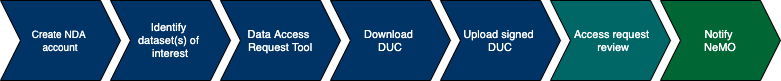

# Accessing Controlled Access Data

Data submitted to NeMO falls into three categories:
* *Public* - data to be immediately distributed openly and freely to the wider research community,
* *Embargo* - data to be held back, or embargoed, until a specific date, at which point it will be released openly and freely to the wider research community,
* *Restricted* - Controlled access data to be distributed only to an approved group of users due to consent restrictions, e.g. human data, through the processes described here. Often restricted datasets contain a combination of private (raw reads, alignments) and public (counts, peaks) datatypes.  In such instances, the dataset landing page or BDBag will provide direct access to public data, in addition to a link to this page for restricted data access instructions.

We are in the process of updating our website to include a list of restricted datasets available for access request. In the meantime, you can
see the list by logging into the [NIMH Data Archive](https://nda.nih.gov/) and selecting Get Data > Request Access. Under
**NDA Controlled Access permissions Groups**, you will find all BRAIN/NeMO restricted datasets currently available for access request.

### In this document:
1. [Requesting access through the NDA Approval Process](#nda-approval-process)
2. [Downloading Data](#downloading-data-using-aspera)
3. [Users with Prior dbGaP Access](#prior-dbgap-access)

&nbsp;

### NDA Approval Process
Permissions for restricted data access at NeMO are being facilitated by the [NIMH Data Archive (NDA)](https://nda.nih.gov/). NDA and NeMO are working together to ensure a smooth process. NDA provides an SOP for institutionally sponsored data access requests [here](https://nda.nih.gov/about/standard-operating-procedures.html#sop4), however this page outlines the steps required for **NeMO-specific** restricted data access.

&nbsp;



&nbsp;

#### Step 1. Create an NDA account
[Create an NDA account here](https://nda.nih.gov/user/create_account.html).

**NDA account requests MUST be made using an institutional email address**.
Account requests made from a personal account will not be honored by NeMO or NDA and will therefore slow down
the process of accessing data.


#### Step 2. Identify Datasets available through the NDA Dashboard
Log in to the [NDA Permissions Dashboard](https://nda.nih.gov/user/dashboard/data_permissions.html).

Here you will find BRAIN/NeMO
Data Archives dataset(s) within the NDA Controlled Access Permission Group table of the dashboard. To the right is
an 'Actions' dropdown. Select "Request Access".
**You must work at a research institution** that has an active
[Federal-Wide Assurance](https://www.hhs.gov/ohrp/federalwide-assurances-fwas.html) in order to initiate a data access request.


#### Step 3. Data Access Request Tool
This will open the Data Access Request Tool where you will provide information pertaining to your research,
institution, and collaborators. Please carefully review the instructions for properly filling out all tabs of the request tool:

##### A) Request Access Instructions


##### B) Research Data Use Statement
Access requests for controlled access permission groups should include a Research Data Use Statement that
appropriately addresses consent-based data use limitations for that permission group.
To determine if there are consent-based data use limitations to which authorized researchers must adhere, refer to the
“Data Use Limitations” field next to the BRAIN/NeMO dataset of interest in the NDA Controlled Access Permission Group table.

##### C) Authorized Research Institute
You must work at a research institution that has an active [Federal-Wide Assurance](https://www.hhs.gov/ohrp/federalwide-assurances-fwas.html) in order to initiate a data access request.
The signing official(s) associated with your institution will automatically appear as a selectable option.

##### D) Other Access Recipients
Each data access application is restricted to users from a **single institution.**
If you have collaborators at other organizations, they must submit a separate data access application.

#### Step 4. Download Data Use Certificate (DUC)
Download the Data Use Certification Agreement PDF from the Agreement tab and complete with signatures of both the investigator and the institutional Signing Official. [Contact the NDA Help Desk](mailto:ndahelp@mail.nih.gov) if you need assistance identifying Signing Officials at your research institution.

  


#### Step 5. Upload signed DUC
Log into the NDA Permissions Dashboard and upload the signed DUC to the “Active Requests” section at the top of the NDA Permissions Dashboard.


&nbsp;


#### Step 6. Review
Your data access request will be reviewed by an NIH Data Access Committee (DAC). This process typically takes about one week.

#### Step 7. Access request decision
NDA will inform investigators of a final access decision.
At this time, you will need to **forward your Access Approval email to the NeMO team** at <a href=“mailto:nemo@som.umaryland.edu”>nemo@som.umaryland.edu</a>. Failure to do so will delay our sending you your access credentials.
NeMO will grant data access to investigator for *one year*, after which investigators will need to reapply for access using the process described above.

&nbsp;


### Downloading Data using Aspera
We are working closely with Google and the University of Maryland to finalize an agreement to provide
restricted NeMO data through Google Cloud Platform. In the meantime, we have made data available through Aspera encrypted data download.
Aspera instructions are available here, and will be replaced by Google Cloud instructions once that mechanism is available.

Once you have been approved for restricted data access, you will receive **two** separate emails:
1) A NeMO Aspera username & password
2) A data encryption key - if you have received access for more than one dataset, you will receive a separate key for each dataset

If you **do not** already have Aspera CLI installed, see [download & installation instructions here](https://github.com/nemoarchive/documentation/blob/master/install_aspera.md).

#### Downloading Files
From your command line terminal, the `aspc` utility is used to download encrypted data using the following syntax:

```bash
$ ascp [-l <Maximum download speed>] [-k 2] [-m <Minimum download speed>] [-Q] [-T] \
    <username>@aspera.nemoarchive.org:/<path to desired files on NeMO server> \
    /path/to/local/download/directory
```
All parameters between the [ ... ] brackets are optional parameters that are described below:
* l - Allows for the user to set a maximum download speed that aspera should attempt to stay at or below for the duration of the transfer. A speed in Megabits must be provided with this flag.
* k - Allow for resumable data transmission in case an interruption occurs.
* m - Allows for the user to set a minimum download sped that aspera should attempt to stay at or above for the duration of the transfer. A speed in Megabits must be provided with this flag.
* Q - Turns adaptive rate on. Adaptive rate controls the speed of aspera with a goal of not dominating the bandwidth available. Very useful on busy networks that may have other transfers ongoing.
* T - Turns encryption off. Turning encryption off will allow for a maximum throughput transfer but should not be provided if data being uploaded is sensitive.

Example invocation to download a single file:

```bash
$ ascp -l 100M -k 2 -QT user@aspera.nemoarchive.org:/my_project/my_data.tar.gz /home/user/my_data/
```
In the above example, Aspera will attempt to keep the maximum transfer speed at 100 Megabits per second. Adaptive
rate flow is turned on so that aspera does not monopolize the network bandwidth. The `my_data.tar.gz` file
will be downloaded to the local `/home/user/data` area.

Downloading a directory of files requires no changes in syntax:

```bash
$ ascp -l 100M -k 2 -QT user@aspera.nemoarchive.org:/my_project /home/user/my_data/
```

Upon entering the command to initiate a download, you will be prompted for your password.  


#### Decrypting downloaded data
Here we recommend decryption tools and provide instructions specific to your operating system:

##### Mac (OSX)
1. Install GPGSuite, available at [https://gpgtools.org/](https://gpgtools.org/)
2. From your command line terminal, run the following command, replacing public.key with the key file provided to you via email:
```
gpg --import public.key
```
3. From your command line terminal, run the following command. Note that the file/directory that you want to write to does **not** need to be created beforehand:
```
gpg --output <path/to/file/to/write/to> --decrypt <path/to/encrypted/file>
```

##### Windows
1. Download and install GPG4Win, available at [https://www.gpg4win.org/](https://www.gpg4win.org/)
2. Open Kleopatra (included in GPG4Win)
3. Go to File -> Import Certificate and select the public key file that was emailed to you
4. Exit Kleopatra
5. Right click on the encrypted file and click "Decrypt and Verify" on the next menu
6. You can change the output folder in this menu

##### Linux
1. Install gpg through your distribution's package manager (apt, yum, etc)
2. Execute the following command from the command line, replacing public.key with the key file provided to you via email:
  ```
  gpg --import public.key
  ```
3. Execute the following command from the command line. Note that the file/directory that you want to write to does **not** need to be created beforehand:
```
gpg --output <path/to/file/to/write/to> --decrypt <path/to/encrypted/file>
```

&nbsp;

## Prior dbGaP Access
Users having previously been granted dbGaP access for NeMO associated datasets do **not** need to reapply for NDA approval,
on the condition that dbGaP access is still within the date of expiration.
In order to gain access restricted NeMO datasets, simply **forward your dbGaP Data Use Certification Agreement to NeMO** at nemo@som.umaryland.edu.
All investigators included in the dbGaP DUC will be assigned Aspera credentials, and can follow the steps described above.
Upon expiration of the dbGap DUC, renewal of access will need to be done through the NDA approval process.
