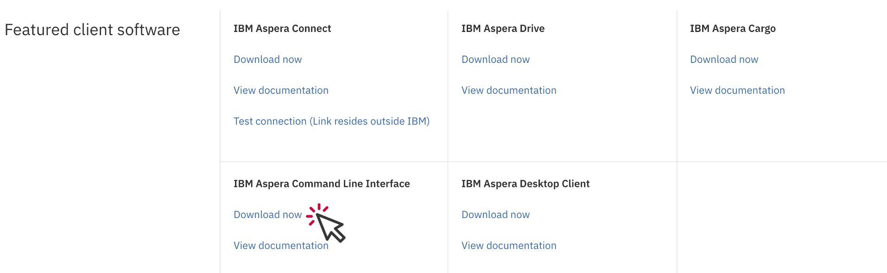

# Download and Install Aspera Command Line Interface (CLI)

Aspera's fasp transfer technology eliminates the fundamental bottlenecks of conventional file transfer
technologies such as FTP, HTTP, and Windows CIFS, and speeds transfers over public and private IP networks.
In addition, users have extraordinary control over individual transfer rates and bandwidth sharing, and full
visibility into bandwidth utilization.

### Download
From the [IBM Aspera website](https://www.ibm.com/products/aspera/downloads),
Scroll to Featured Client Software, and select the IBM Aspera Command Line Interface Client > Download now.



Select the most recent release for your operating system. Log into your IBMid account, or set up a free account if you have not previously done so.

Choose your method of download. Make sure that the box next to "Include prerequisites and co-requisite fixes" is checked.
Follow download instructions.

### Install
To install the Aspera CLI, run the installation script from your command line terminal of choice:

```
$ sh aspera-cli-x.x.x.xxx.xxxxxxx-mac-xx.x-64-release.sh
```

The script places the Aspera CLI in the $HOME/Applications/Aspera CLI directory. To install the Aspera CLI in your PATH,
run the following command:

```
$ export PATH=~/Applications/Aspera\ CLI/bin:$PATH
```

The `ascp` utility will now be available for use at the command line.
