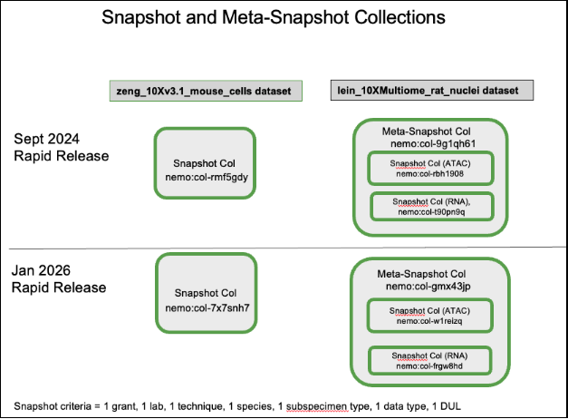
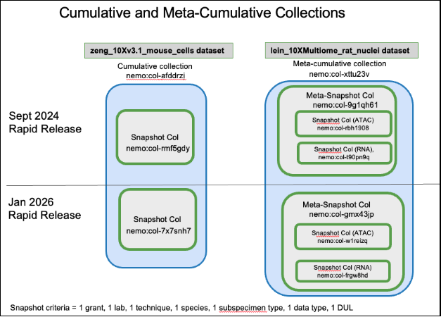
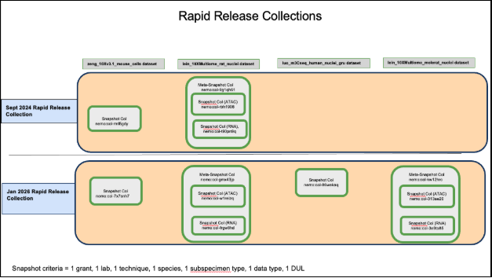
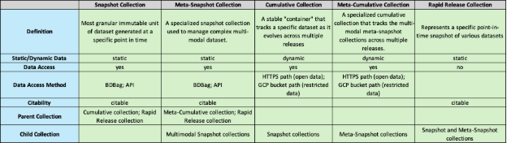
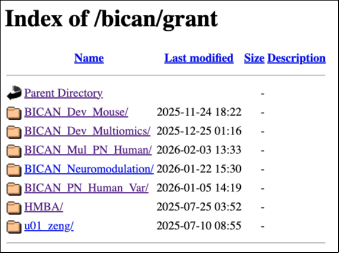
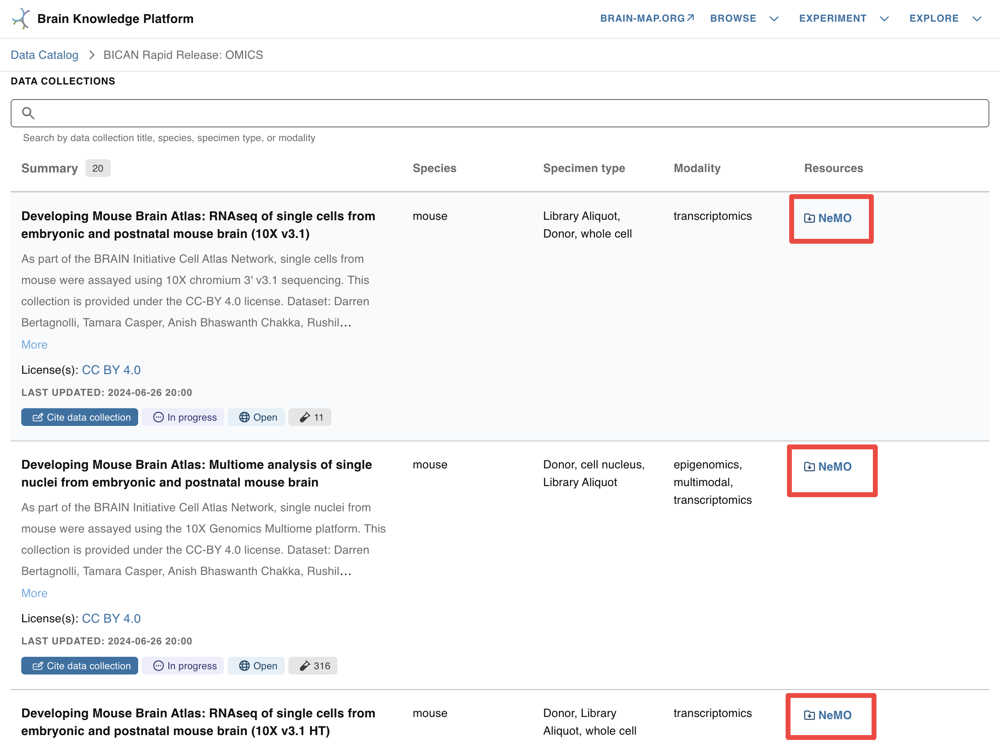

# **<h2 style = "text-align: center;">NeMO: Rapid Release Collections and Data Access</h2>**

1) <a href = "#intro-collection-types">Introduction to Rapid Release Collection Types</a>
    1) <a href = "#snapshot-collections">Snapshot Collections (static)</a>
    2) <a href = "#cumulative-collections">Cumulative Collections (dynamic)</a>
    3) <a href = "#rapid-release-collection">Rapid Release Collection (static)</a>
    4) <a href = "#overview-collection-types">Overview of Collection Types</a>
2) <a href = "#data-collections-available">Data Collections available through Rapid Releases</a>
3) <a href = "#accessing-rapid-release">Accessing Rapid Release Data</a>
    1) <a href = "#landing-pages">Landing Pages</a>
    2) <a href = "#nemo-api">NeMO API endpoints</a>
    3) <a href = "#https-location">HTTPS location</a>
4) <a href = "#accessing-allen">Accessing NeMO Collections from Allen's Brain Knowledge Platform (BKP)</a>
    1) <a href = "#nemo-collections-linked">NeMO Collections linked in BKP Project Pages</a>
    2) <a href = "#metadata-search">Metadata Search and File Manifest Retrieval from Specimen table of BKP's Data  Catalog</a>

## <h2 id = "intro-collection-types" style = "display: inline">Introduction to Rapid Release Collection Types</h2>
 

The **Rapid Release** in [BICAN](https://www.portal.brain-bican.org/) is the immediate dissemination of high-quality, raw, and initial-processed -omics data (such as single-cell transcriptomics and epigenomics) to the public, typically within one calendar quarter (3 months) of its generation. It enables researchers to begin secondary analyses, develop new computational tools, or validate their own findings against the newest available brain cell maps.

NeMO utilizes specialized **Snapshot, Cumulative**, and **Rapid Release** collections to ensure the data released remains accessible and citable as data evolves.

### <h3 id = "snapshot-collections" style = "display: inline">**Snapshot Collections (static)**</h3>
A “Snapshot” collection is the most granular immutable unit of dataset generated at a specific point in time defined by a unique combination of seven criteria: grant, lab, technique, species, subspecimen type, data type, and data use limitation (DUL). A new snapshot collection with a nemo identifier is created for files if the collection defined by the seven criteria was not part of the previous Rapid Release. Additionally, a snapshot collection is generated with a new NeMO identifier each time a Rapid Release occurs when there are new or modified files within that specific dataset. However, if no new data is included for a particular snapshot collection, the same collection identifier from the previous release is linked to the new Rapid Release. Please refer to ‘Diagram 1’ below. The files associated with these collections are packaged as BDBags for standardized data transfer. Each snapshot collection has a dedicated landing page that includes metadata associated with the data in the collection (such as taxa, modality, assay, technique, grant number, protocols, open or restricted data access etc.), a link to the BDBag, a specific data citation, and a link to the parent cumulative collection landing page. The landing page can be identified as a snapshot collection based on the collection name, which includes the prefix “BICAN\_\_Snapshot”. The pages are hosted at [assets.nemoarchive.org](https://assets.nemoarchive.org/). To access the landing page for a specific collection in a web browser, append the NeMO identifier (‘col’ or ‘dat’ identifier) to the end of the URL, example: <https://assets.nemoarchive.org/collection/nemo:col-7x7snh7>.

A “Meta-Snapshot” collection is a specialized snapshot collection used to manage complex multi-modal dataset, such as Multiome datasets (e.g., RNA-seq and ATAC-seq performed on the same cells). These are "collections of snapshot collections" created at a specific point in time. A meta-snapshot collection is a parent for member snapshot collection. Please refer to ‘Diagram 1’ below. Its landing page contains a list of member snapshot collection landing page links, also including a “bag of bag” which is a parent BDBag packaged with child snapshot collection BDBags. The landing page can be identified as a meta-snapshot collection based on the collection name, which includes the prefix “BICAN\_\_MetaSnapshot”. Example: <https://assets.nemoarchive.org/collection/nemo:col-myr9nn1>, is a multiome meta-snapshot collection landing page containing links to specific RNA-seq snapshot collection and an ATAC-seq snapshot collection generated for Jan, 2026 rapid release cycle. Each snapshot and meta-snapshot collection is a comprehensive aggregate, encompassing all data captured from the initial aliquot submission through the moment of collection generation.

Please refer to the section "[Accessing Rapid Release Data](#accessing-rapid-release)" for downloading data associated with snapshot and meta-snapshot collections.

**Diagram 1:**

### <h3 id = "cumulative-collections" style = "display: inline">**Cumulative Collections (dynamic)**</h3>
A “Cumulative” collection acts as a stable "container" that tracks a specific dataset as it evolves across multiple releases. It represents a "collection of collections", where the members are all the individual static snapshot collections defined by a unique combination of seven criteria produced over various Rapid Release cycles. Please refer to ‘Diagram 2’ below. Unlike snapshot collection NeMO identifiers, cumulative collection identifiers don’t change as new Rapid Releases occur. The cumulative collection landing page provides a chronological list of individual static snapshot collection landing page links. They provide a persistent entry point for researchers to find the most current version of a dataset or view its history. They don’t contain BDBag links but provide links to the HTTPS location for accessing open data or the GCP release bucket path (“gs://”) for restricted data. The pages are hosted at [assets.nemoarchive.org](https://assets.nemoarchive.org/). To access the landing page for a specific collection in a web browser, append the NeMO identifier (‘col’ or ‘dat’ identifier) to the end of the URL, example: <https://assets.nemoarchive.org/nemo:col-afddrzj>. The landing page can be identified as a cumulative collection based on the collection name, which includes the prefix “BICAN\_\_Cumulative”.

A “Meta-Cumulative” collection is a specialized cumulative collection that tracks the multi-modal meta-snapshot collections across multiple releases. It tracks the evolution of the member meta-snapshot collections across various Rapid Release cycles, ensuring that researchers can always find the latest multi-modal data through a single, persistent identifier. Similar to a standard cumulative collection, the meta-cumulative identifier remains constant across releases and don’t contain BDBag links but provide direct links to the HTTPS location for accessing open data or the GCP release bucket path (“gs://”) for restricted data. Please refer to ‘Diagram 2’ below. Example:<https://assets.nemoarchive.org/col-iefmnby>.

**Diagram 2:**

### <h3 id = "rapid-release-collection" style = "display: inline">**Rapid Release Collection (static)**</h3>
A “Rapid Release” collection represents a specific point-in-time snapshot of various datasets i.e., temporal grouping of all data released during a specific window of time. Each rapid release collection is composed of multiple unique static snapshot and meta-snapshot collections generated during that period. A new persistent rapid release NeMO identifier is generated with every rapid release. Each rapid release has a dedicated landing page including links to member snapshot collection landing pages. The landing page does not include a BDBag, nor does it provide HTTPS or GCP release bucket paths. Please refer to  ‘Diagram 3’ below.

**Diagram 3:**

### <h3 id = "overview-collection-types" style = "display: inline">**Overview of Collection Types**</h3>

## <h2 id = "data-collections-available" style = "display: inline">Data Collections available through Rapid Releases</h2>
 
All data collections released through the two Rapid Releases are publicly accessible. All collections from the September, 2024 Rapid Release contain open-access files available for free download. Except for two collections, all other January 2026 Rapid Release collections containing open-access data are freely available for download. The two exceptions contain restricted human fastq files, which can be accessed only upon <a href = "https://nemoarchive.org/resources/accessing-controlled-access-data#nda-approval-process">approval</a> from the NIMH Data Archive (NDA).

[Here](https://docs.google.com/spreadsheets/d/1cN_dqdG-2fhCcHqCuxiXQ0Pn2sUo8o2J/edit?usp=sharing&ouid=109292309009829585903&rtpof=true&sd=true) are the collection NeMO identifiers associated with Sept, 2024 and Jan, 2026 Rapid Releases.

## <h2 id = "accessing-rapid-release" style = "display: inline">Accessing Rapid Release Data</h2>
 

The following options are available for accessing Rapid Release data:

### <h3 id = "landing-pages" style = "display: inline">**Landing Pages**</h3>

 

**Snapshot and Meta-snapshot collection landing pages:**

Snapshot and meta-snapshot collection landing pages (https://assets.nemoarchive.org/api/collection/<nemo\_identifier>) provide links to downloadable BDBags (an archive file containing downloadable file paths). To retrieve files, users must install the BDBag software. Detailed [instructions](https://docs.google.com/document/d/19saVuxG3H3j7i535eXoQEn6ypEUtIdvMnVjdbSMiKkU/edit) for installing the tool and downloading files are available in the BDBag documentation. More information is available [here](https://github.com/nemoarchive/documentation/blob/master/download_bdbag.md). Each snapshot collection links to a single BDBag that includes a file metadata manifest listing all files available for download along with their associated metadata. A key metadata field in this manifest is the “library\_aliquot\_nhash\_id”, a unique identifier for a library aliquot generated by the [NIMP](https://brain-specimenportal.org/welcome/index). This identifier can be used to retrieve donor and specimen metadata from the [Brain Knowledge Platform’s (BKP) Data Catalog](https://knowledge.brain-map.org/data/BUQ7G50XHDCFCJCQ03A/specimens) Specimen table and from [NIMP](https://brain-specimenportal.org/welcome/index) via their [APIs](https://docs.google.com/document/d/13Kf_Ieag2viy5JOn5hDo82awuqbuulti/edit#heading=h.ig7kxpk6rhxc).

Meta-snapshot collection (eg: multiome) landing pages provide links to a master BDBag (a "bag of bags"). This master BDBag contains individual child BDBags, one for each snapshot collection included in the meta-snapshot. Each child BDBag includes its own file metadata manifest.

* **Open data BDBags:** The BDBags linked in collections with open data contain downloadable HTTPS file paths.
* **Restricted data BDBags:** The BDBags linked in collections with restricted data have GCP bucket file paths (gs://). Files referenced by these paths can be downloaded by users only after NeMO grants them access following <a href = "https://nemoarchive.org/resources/accessing-controlled-access-data#nda-approval-process">approval</a> from the NIMH Data Archive (NDA).

**Cumulative and Meta-cumulative collection landing pages:**

The cumulative and meta-cumulative collection landing pages do not contain links to BDBags but contain HTTPS paths for open access data and GCP bucket path (gs://) for restricted data. Restricted files referenced by GCP bucket paths (gs://) can be downloaded by users only after NeMO grants them access following <a href = "https://nemoarchive.org/resources/accessing-controlled-access-data#nda-approval-process">approval</a> from the NIMH Data Archive (NDA).

**Rapid release collection landing page:**

Files cannot be downloaded directly from this page. To access the data, users must navigate to each child snapshot collection landing page for accessing the files via a BDBag or [NeMO API](#nemo-api).

### <h3 id = "nemo-api" style = "display: inline">**NeMO API endpoints**</h3>
The NeMO API enables users to access and download data associated with grants, projects, subjects, samples (including libraries and aliquots), collections (including publications), and files. Both landing pages and API endpoints support metadata retrieval using NeMO identifiers as well as NIMP NHASH identifiers. API resources are available at [https://assets.nemoarchive.org](https://assets.nemoarchive.org/) and do not require user authentication. Only publicly accessible metadata are displayed through the landing pages and APIs. Please refer to the detailed [documentation](https://github.com/nemoarchive/documentation/blob/master/nemo_assets_api.md) on using the NeMO APIs to retrieve collection data.

Files associated with both snapshot and meta-snapshot collections can be retrieved using NeMO API endpoints. For collections containing restricted data, the file endpoints return restricted GCP bucket file paths, however, files can be downloaded only after the user has been granted access to the corresponding bucket. Please refer to the documentation describing the NIMH Data Archive (NDA) <a href = "https://nemoarchive.org/resources/accessing-controlled-access-data#nda-approval-process">approval</a> process for obtaining bucket access through NeMO.

**Example 1:** Retrieving files associated with a snapshot collection (nemo:col-a06sk1r) using paginated file endpoint

[https://assets.nemoarchive.org/api/collection/nemo:col-a06sk1r/files?page=1&page_size=100](https://assets.nemoarchive.org/api/collection/nemo:col-a06sk1r/files?page=1&page_size=100)

**Example 2:** Retrieving files associated with a meta-snapshot collection (nemo:col-myr9nn1).

* Retrieve the two child snapshot collection endpoint URLs under meta-snapshot collection using collection endpoint.

    <https://assets.nemoarchive.org/api/collection/nemo:col-myr9nn1>

* Retrieve files associated with each snapshot collection using paginated file endpoint

    <https://assets.nemoarchive.org/api/collection/nemo:col-0onu0di/files?page=1&page_size=100> (ATAC dataset)

    <https://assets.nemoarchive.org/api/collection/nemo:col-o29aa39/files?page=1&page_size=100> (RNA dataset)

### <h3 id = "https-location" style = "display: inline">**HTTPS location**</h3>
The open access BICAN data are released at <https://data.nemoarchive.org/>. Grant specific data can be accessed by navigating through the data directory structure. The top-level (root) directory is organized by program. Within each program, data are further organized by grant, lab, modality, subspecimen type, technique, species, data type and aliquot name. Please note that the HTTPS location contains files released during the continuous release process (i.e., data automatically released after an embargo period ends). Consequently, some files may not be included in a Rapid Release collection. 

Individual files can be downloaded directly from the browser by right-clicking the file and selecting “Copy” or “Save link as.” For downloading via command line, use any online tools that support http downloads such as Wget or cURL. Only cumulative and meta-cumulative collections with open access data are linked with HTTPS file locations. 

HTTPS location of BICAN data: [https://data.nemoarchive.org/bican/grant/](https://data.nemoarchive.org/bican/grant/)

## <h2 style = "display:inline-block" id = "accessing-allen">**Accessing NeMO Collections from Allen's Brain Knowledge Platform (BKP)**</h2>
 

There are two ways of finding NeMO collection data at Brain Knowledge Platform Data Catalog:

* NeMO Collections linked in BKP Project Pages
* Metadata search and file manifest retrieval from specimen table of BKP's Data Catalog

**<h3 style = "display:inline-block" id="nemo-collections-linked">NeMO Collections linked in BKP Project Pages</h3>**

The NeMO collection landing page URLs are linked in each collection listed in "DATA COLLECTIONS" section in the project page - "[BICAN Rapid Release Inventory: Single cell transcriptomics and epigenomics](https://knowledge.brain-map.org/data/BUQ7G50XHDCFCJCQ03A/summary)". Click on the "NEMO" links to navigate to the corresponding collection landing pages where you will find links to collection BDBag and HTTPS path for file download. Refer to the [document](https://docs.google.com/document/d/19saVuxG3H3j7i535eXoQEn6ypEUtIdvMnVjdbSMiKkU/edit) with details on downloading files using a BDBag. Details on accessing files from HTTPS links are in the section "[HTTPS location](#https-location)" of this document. Allen Institute's documentation on finding data for collections is [here](https://community.brain-map.org/t/bican-rapid-release-reference-documentation/3693).

**<h3 style = "display:inline-block" id="metadata-search">Metadata Search and File Manifest Retrieval from Specimen table of BKP’s Data Catalog</h3>**

A tutorial on searching the metadata and downloading a file manifest from [Specimen Table](https://knowledge.brain-map.org/data/BUQ7G50XHDCFCJCQ03A/specimens) of BKP’s Data Catalog is posted for users reference here- “[Download a file manifest for all female chimpanzees from Ed Lein’s - UM1MH130981 BICAN grant](https://community.brain-map.org/t/tutorial-download-a-file-manifest-for-all-female-chimpanzees-from-ed-lein-s-um1mh130981-bican-grant/3692)". 

The file manifest downloaded from Data Catalog containing the HTTPS file paths can be used as an input into the Portal-Client tool to download the files after reformatting the manifest. Instructions can be found [here in the Allen Brain Map Community Forum](https://community.brain-map.org/t/how-to-use-bkp-file-manifest-to-access-bican-data-at-nemo-archive/3505#manifest-download-and-formatting-1). 

**Please email [nemo@som.umaryland.edu](mailto:nemo@som.umaryland.edu) if you have any issues/suggestions/comments.**
