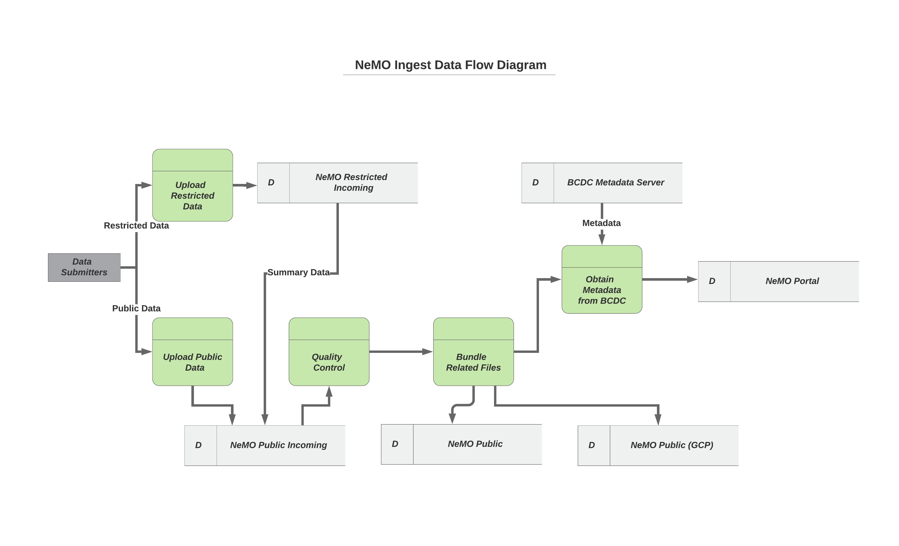

# Data Submissions

This section describes the process that data submitters can use to send data to the NeMO Archive. Data submitted to NeMO falls in three broad categories; data that can be freely distributed with the wider research community, data that needs to be embargoed, and restricted data that can only be distributed to a select group of users because of the nature of the data, i.e., it is human data that has special consent requirements and needs approval from NIH for data access.

Please see the [Submitting Data to NeMO](Submitting-Data-To-NeMO) section to submit data that can be freely distributed with the wider research community. Currently we do not have a mechanism to embargo data, so please hold off on submitting that data till you are ready to share with the wider research community. For data that is restricted please see the instructions in the [Submitting Restricted Data](Submitting-Restricted-Data) section.

There may be instances where some of the data is restricted, for instance the raw reads and alignment files from human data, while the downstream analyses results such as gene expression counts, or ChIPseq peak calls stored as BED of WIG files, are freely distributable. In such instances we recommend submitting the data to the restricted area and let us know specific data types that are distributable.

Once data is submitted to NeMO we perform basic quality checks to ensure that that the MD5 checksums are valid, and that all the related files are present. Once this criteria is met we move these files to the public area where users can use the tools at NeMO to browse and download the files. Before we can make this data searchable through the portal we need for users to submit the metadata to the BCDC which will allow us to make this data searchable through the NeMO Data Portal. The figure below shows the data flow at the NeMO Archive. It can typically can take between few days to a few weeks for processing and moving data between each of the data stores.

Links found in this section:

* [Submitting Data to NeMO](Submitting-Data-To-NeMO)
* [Browsing Submitted Data](Browsing-Submitted-Data)
* [Submitting Restricted Data](Submitting-Restricted-Data)
