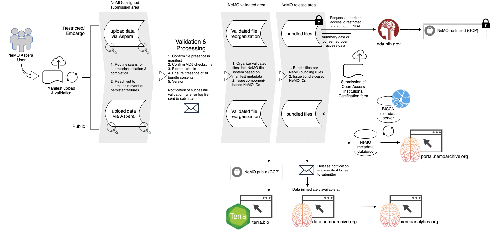

# Submitting Data to NeMO

Data submitted to NeMO falls into three categories:
* *Public* - data to be immediately distributed openly and freely to the wider research community,
* *Embargo* - data to be held back, or embargoed, until a specific date, at which point it will be released openly and freely to the wider research community,
* *Restricted* - Controlled access data to be distributed only to an approved group of users due to consent restrictions, e.g. human data. Often restricted datasets contain a combination of private (raw reads, alignments) and public (counts, peaks) datatypes.  In such instances, **users will submit all data to the Restricted area** and we will work with them to obtain consent for releasing any files publicly.


### In this document:
1. [Requesting a NeMO Aspera account](#requesting-a-nemo-aspera-account)
2. [Submitting a File Manifest](#submitting-a-file-manifest)
3. [Submitting data](#submitting-data)
4. [Processing workflow](#processing-workflow)

&nbsp;

### Requesting a NeMO Aspera Account
New data submitters can register for an account at [nemoarchive.org/register.php](https://nemoarchive.org/register.php). Upon doing so, please send an email to [nemo@som.umaryland.edu](mailto:nemo@som.umaryland.edu) with the following information:
* requested username
* grant under which data was generated
* PI of lab in which data was generated
* whether data is public, for embargo or restricted*

*Restricted data submitters are asked to request account usernames with an appended "-restricted", e.g. `doe-restricted`. If you will be submitting both public and controlled access data, you will need to create two accounts, one without and one with the "-restricted" tag.

Someone from the NeMO team will follow up with you regarding any other questions about your data or the submission process. 

&nbsp;
### Submitting a File Manifest
All submissions to NeMO Archives, whether public or private, begin with upload of a file manifest including MD5 checksums, through the [NeMO manifest submission page](https://assets.nemoarchive.org/manifest_submission/).
Because we do not dictate file naming conventions, and are no longer defining the specific directory structure that your data submission must contain, it is necessary for us to collect some basic information in order to process your data properly for release. This is not a comprehensive metadata collection and should be straightforward to populate.

Detection and validation of a properly formatted manifest will trigger a message providing the Aspera submission path for your data, see below.


#### Manifest format
[File manifest template in tsv format](./manifest_template.tsv)

[Excel-friendly manifest file with field descriptions and controlled vocabularies](https://drive.google.com/file/d/1Z7h1_6Wgw8OurEoOAXU94yQcU5n0rLBK/view?usp=sharing) - Please contact NeMO to discuss addition of new terms to the any of the controlled vocabularies.

All manifest files must contain the following fields. Do not delete headers for unused, optional columns:
 * File name
 * Sample ID
 * Program (e.g. BICCN)
 * Sub-program (e.g. U19 Zeng)
 * Lab
 * Species
 * Modality
 * Technique
 * Subspecimen type
 * Data type
 * File type
 * Access
 * Checksum - described below
 * Anatomical site (optional for current release cycle)
 * Counts data only fields (optional):
   - Counts pipeline
 * Aligned data only fields (optional):
   - Read aligner
   - Genome build
   - Gene set release
 * BRAIN initiative only fields (optional, but highly recommended):
   - BCDC Project name
   - BCDC data collection
 * Controlled access only fields (optional):
   - Usage (e.g. Limited/GRU/NA)
   - Institutional Certification ID
   - Donor id/name
   - Tissue provider

The manifest file must contain **one row, including an MD5 checksum, for every file included in the submission**. If you're submitting a tarball, the manifest should contain one row for every file within the tarball. For submission of multiple, or chunked, tarballs, there is no need for a manifest per tarball, all component files can be included in a single manifest.

The first column should contain the file name only, no path information. If populating the manifest in Excel or Numbers, save as a comma or tab delimited file. The manifest file can have any prefix, however the base filename **must** be `manifest.[ext]`, where [ext] can be csv, tsv or tab. All formats will be converted to TSV. Failure to name your manifest file accordingly will prevent detection of your manifest, delaying validation.

#### Manifest validation
Upon upload to the [NeMO manifest submission page](https://assets.nemoarchive.org/manifest_submission/), file manifests will be immediately validated for:
* complete header row
* presence of checksums and all other required fields
* proper controlled vocabularies
* detection of unexpected file extensions
* presence of all components of various bundle types

Validation failure in any row(s) will result in an error message displayed on the submission page. Once errors are corrected, an updated validation file is submitted in the same way and undergoes the same validation.

Validation success will result in notification within minutes, via email, of the Aspera path to which you will submit your data, as described below. Be sure to submit to the provided path, as any other submissions will be ignored and routinely deleted.

&nbsp;

### Submitting Data

#### Currently accepted data types
NeMO accepts both raw and derived data types of the file extensions [listed here](https://github.com/nemoarchive/documentation/blob/master/file_extensions.md). If you plan to submit data extensions not currently on this list, please let us know ahead of time to avoid manifest upload and/or processing delays, by emailing nemo@som.umaryland.edu.

Depending on the size of your submission, it may be preferable to submit data files individually or within a tarball. Either is fine. We don't pre-define any specific directory structure for your submission, however we ask that you do not submit tarballs within a tarball, as that will delay processing. Files will be reorganized during ingest based on metadata provided in the manifest.


#### Uploading using Aspera
In order to submit data to NeMO, you will first need to download and install the IBM Aspera Command Line Interface,
available from the [IBM website](https://www.ibm.com/products/aspera/downloads).
You will find the download link under `Featured client software` > `IBM Aspera Command Line Interface`.
Select the most recent release for your operating system. You will need to create an IBM account if you do not already have one. Installation instructions are available [here](https://github.com/nemoarchive/documentation/blob/master/install_aspera.md).

Once installed, the `ascp` utility will be available for use at the command line. Have your NeMO Aspera credentials handy, as commands to initiate an upload will result in a prompt for your password.

Uploading with the Aspera client uses the following syntax:

```bash
$ ascp [-l <Maximum download speed>] [-k 2] [-m <Minimum download speed>] [-Q] [-T] \
<path to local file or directory> <username>@aspera.nemoarchive.org \
    /provided/path/to/NeMO/directory/
```

All parameters between the [ ... ] brackets are optional parameters described here:

```
l - Allows for the user to set a maximum upload/download speed that aspera should attempt to stay at or below for the duration of the transfer. A speed in Megabits must be provided with this flag.
k - Allow for resumable data transmission in case an interruption occurs.
m - Allows for the user to set a minimum upload/download sped that aspera should attempt to stay at or above for the duration of the transfer. A speed in Megabits must be provided with this flag.
Q - Turns adaptive rate on. Adaptive rate controls the speed of aspera with a goal of not dominating the bandwidth available. Very useful on busy networks that may have other transfers ongoing.
T - Turns encryption off. Turning encryption off will allow for a maximum throughput transfer but should not be provided if data being uploaded is sensitive.
```

In the following example, `my_data.tar.gz` is being transferred to NeMO,

```bash
$ ascp -l 100M -k 2 -QT /home/user/my_data/my_data.tar.gz user123@aspera.nemoarchive.org:/v34kltf7/
```
where `v34kltf7` is the directory name provided upon manifest validation. Uploading a directory of files would not require any changes as Aspera will recognize that a folder is being transferred and will recursively step through ensuring all files found in the directory are transferred.

```bash
$ ascp -l 100M -k 2 -QT /home/user/my_data/ user123@aspera.nemoarchive.org:/v34kltf7/
```

It is not possible to delete or update data using the Aspera CLI, however submitting a file of the same name **will** overwrite the previous file. Should you wish to delete data, reach out to a NeMO team member at [nemo@som.umaryland.edu](mailto:nemo@som.umaryland.edu).

&nbsp;

### Processing workflow
&nbsp;



&nbsp;  

**For restricted data**, the validation and ingest process is the same. The [Restricted Data Release documentation](./release_restricted.md) outlines steps required to make restricted datasets available to approved users or the public, as applicable.


#### Quarterly inventories
Registration for a NeMO Aspera account will also trigger an invitation to join the NeMO Archive groups.io main group and appropriate grant-specific subgroups. As a member of these groups, submitters will receive quarterly inventory files. These groups are also used for quarterly update reminders and other important information. If you would like to be added or to add someone else from your group to groups.io, please email [nemo@som.umaryland.edu](mailto:nemo@som.umaryland.edu).
