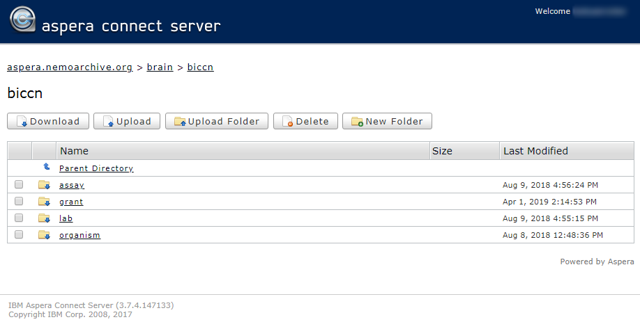

Data submissions to NeMO include the submission of the raw sequence files as well as derived intermediate files such as BAM files, and analyzed results including counts and cluster information. In addition, data submitters also submit metadata associated with the data to BCDC.

Presently data submissions are accomplished by uploading data to the archive using Aspera. To install Aspera, please go to the Aspera website and download the [Aspera CLI Client](http://downloads.asperasoft.com/en/downloads/62). Once installed, you should have the ascp utility available to you. Instructions for uploading data using Aspera are [continued below](#aspera).
To upload data to NeMO you will need credentials, which can be obtained by completing the [account request form](https://nemoarchive.org/register.php).

To make the data easily findable by end users we have established a consistent directory structure for the projects and studies in the repository that is shown in the figure below. We request that you please adhere to the same directory structure for your data. Please create this directory structure and place files where necessary *before* uploading. You do not need to include directories that will be empty.

```
biccn
└── grant
    ├── cemba
    │   ├── callaway
    │   │   └── projection
    │   │       ├── bulk
    │   │       │   ├── processed
    │   │       │   │   ├── align
    │   │       │   │   └── peaks
    │   │       │   └── raw
    │   │       └── sncell
    │   │           ├── processed
    │   │           │   ├── align
    │   │           │   └── peaks
    │   │           └── raw
    │   └── ecker
    │       ├── chromatin
    │       │   └── scell
    │       │       ├── processed
    │       │       │   ├── align
    │       │       │   └── counts
    │       │       └── raw
    │       └── methylation
    │           ├── bulk
    │           │   ├── processed
    │           │   │   ├── align
    │           │   │   └── peaks
    │           │   └── raw
    │           └── scell
    │               ├── processed
    │               │   ├── align
    │               │   ├── allc
    │               │   ├── counts
    │               │   └── peaks
    │               └── raw
    ├── devhu
    │   └── kriegstein
    │       └── transcriptome
    │           ├── scell
    │           │   └── processed
    │           │       └── counts
    │           └── sncell
    │               └── processed
    │                   └── counts
    └── feng
        └── feng
            └── transcriptome
                └── scell
                    └── raw
```

Please substitute your grant abbreviation, and lab name (use grant abbreviation if a single lab is generating data). For instance in the above image <i>cemba</i> is the grant name, and <i>ecker</i> is the lab name.

You may use Aspera to copy the contents of the directory recursively, or alternately and preferably, you can create a submission tar and upload the tar to us.

To verify that the files transferred to us are not corrupted we use MD5 checksums to validate the transfer. So please submit the MD5 checksums with your data uploads. See the [section below](#md5-checksum) for generating the MD5 checksums and the specific file format to submit the MD5 checksums.

For example, for a submission.tar.gz file, the unpacked structure would look something like:
```
submission.tar.gz
├── md5sums.txt
└── my_lab
    └── chromatin
        ├── bulk
        │   ├── processed
        │   │   └── A
        │   └── raw
        │       └── B
        └── sncell
            ├── processed
            │   └── C
            └── raw
                └── D
```


## Current file extension list
The NeMO ingest scripts allow the file extensions [listed here](file_extensions). If you will be submitting extensions not currently on tihs list, please let us know ahead of time, if possible, to avoid processing delays. 


## Uploading Data using Aspera <a name="aspera"></a>
Once the Aspera client has been successfully installed, transfers to and from the NeMO Aspera server can be executed with your NeMO username and password. Commands to initiate an upload will result in a prompt for your password.

Uploading with the aspera client uses the following syntax:

```$ ascp [-l <Maximum upload speed>] [-k 2] [-m <Minimum upload speed>] [-Q] [-T] \
    <path to local file or directory> <username>@aspera.nemoarchive.org \
    /path/to/NeMO/grant/directory/
```

All parameters between the [ ... ] brackets are optional parameters described below:

    l - Allows for the user to set a maximum upload/download speed that aspera should attempt to stay at or below for the duration of the transfer. A speed in Megabits must be provided with this flag.
    k - Allow for resumable data transmission in case an interruption occurs.
    m - Allows for the user to set a minimum upload/download sped that aspera should attempt to stay at or above for the duration of the transfer. A speed in Megabits must be provided with this flag.
    Q - Turns adaptive rate on. Adaptive rate controls the speed of aspera with a goal of not dominating the bandwidth available. Very useful on busy networks that may have other transfers ongoing.
    T - Turns encryption off. Turning encryption off will allow for a maximum throughput transfer but should not be provided if data being uploaded is sensitive.

In the following example, my_data.tar.gz is being transferred to the Ecker lab's repository, within the cemba grant:
```$ ascp -l 100M -k 2 -QT /home/user/my_data/my_data.tar.gz user123@aspera.nemoarchive.org:/biccn/grant/cemba/ecker/```

Uploading a directory of files would not require any changes as Aspera will recognize that a folder is being transferred and will recursively step through ensuring that all files found in the directory are transferred.

```$ ascp -l 100M -k 2 -QT /home/user/my_data/ user123@aspera.nemoarchive.org:/biccn/grant/cemba/ecker/```


## MD5 Checksum Format <a name="md5-checksum"></a>
The checksum file must be named "md5sums.txt" (all lower case, with Unix line endings). It should be placed in the root of the tarball submission. File format is to be compatible with the standard `md5sum` utility, that is:

```<128-bit hexadecimal md5 checksum><2 spaces><file path relative to tarball root>```

Then the contents of the md5sums.txt checksum file would be in the format below (this example shows dummy checksums and filenames):
```
b71aacdabe99a51474ba84fa03ec61ec  my_lab/chromatin/sncell/processed/C
24c37182df9ead481be538a4dcecf641  my_lab/chromatin/sncell/raw/D
6cbc24a41a4c28ff1eeec14ccf70e3cc  my_lab/chromatin/bulk/processed/A
4253c8c3af0c12a9188f5342841d4ec9  my_lab/chromatin/bulk/raw/B
```


## Confirming Submitted Data
Data submitted to NeMO is placed in a special "incoming" holding area while the data is being reviewed for quality control. While in this area, the submitted data is still browsable using the Aspera web interface. Please point your web browser to [https://aspera.nemoarchive.org](https://aspera.nemoarchive.org). After logging in with your NeMO Archive credentials, you may be prompted to download and install a web browser plugin. Please follow the directions. If you have installed the browser plugin correctly, you will be able to navigate up and down the filesystem structure with the interface that is presented, which should look very similar to the figure below:



Presently, the Aspera web interface is the only way to browse submitted data before it has been released.
